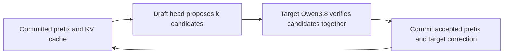
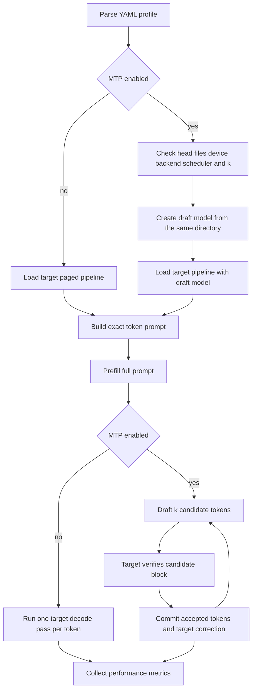

# Copyright (C) 2026 Intel Corporation
# SPDX-License-Identifier: Apache-2.0

# Qwen3.8 MTP Design and Speculative Decoding Guide

## Purpose and Scope

This document explains the experimental [OpenVINO Qwen3.8 MTP notebook](https://github.com/openvinotoolkit/openvino_notebooks/blob/latest/notebooks/qwen3.8-mtp/qwen3.8-mtp.ipynb), the matching implementation in this repository's `context_bench`, and how it differs from other speculative-decoding designs.

The scope is decode acceleration. MTP does not reduce the cost of reading a long prompt (prefill), does not independently improve summary quality, and is not a generic switch that can be enabled on arbitrary Qwen exports.

## Executive Summary

Qwen3.8-27B ships a small MTP draft head in its model checkpoint. OpenVINO GenAI loads that head from the same model directory, lets it propose a fixed number $k$ of future tokens, and asks the full Qwen model to verify those candidates in one forward pass. The verifier commits the matching prefix and supplies a correction token if needed. This reduces the number of expensive full-model decode passes.

This is **self-speculative decoding**:

- The target model is Qwen3.8-27B.
- The drafter is its built-in `openvino_mtp_model.xml`, not a separately chosen small LLM.
- The target remains the authority for every emitted token. With compatible greedy settings, speculative decoding preserves the target's greedy sequence; the draft only changes execution order.
- The method accelerates decode/TPOT, not prefill/TTFT.

The checked-in GPU result at 8K input and approximately 61 output tokens improved decode throughput from 7.37 tokens/s to 12.30-12.93 tokens/s ($66.9\%-75.4\%$). End-to-end throughput improved only $16.8\%-18.1\%$ because the 8K prefill dominated total time. These measurements are workload-specific, not a general speedup guarantee.

## Terminology

| Term | Meaning in this document |
|---|---|
| Target/verifier | The full Qwen3.8 model whose next-token decisions define the result. |
| Draft/drafter | A cheaper model or head that proposes future tokens. |
| Lookahead, $k$ | `num_assistant_tokens`: draft candidates proposed in each cycle. |
| Verification step | One target forward pass over the proposed continuation. |
| Accepted prefix | Consecutive draft tokens that agree with the verifier before the first mismatch. |
| Bonus/correction token | Target token emitted in a verification step. It is not a draft acceptance. |
| Prefill / TTFT | Processing the input context before the first output token. |
| Decode / TPOT | Autoregressive output generation after prefill; time per output token. |

## Baseline Autoregressive Decoding

Without speculation, after prefill a target model produces one token per decode iteration:

```text
context -> target -> y1
context,y1 -> target -> y2
context,y1,y2 -> target -> y3
...
```

For $N$ output tokens, the target executes roughly $N$ decode steps. The target pass is costly because it includes the whole model and reads growing KV state. Long input makes the initial prefill expensive; long output makes the repeated decode phase expensive.

## Generic Speculative Decoding Protocol

The generic lossless protocol separates proposal from verification.

1. The drafter predicts a continuation $d_1, d_2, \ldots, d_k$ from the current accepted prefix.
2. The target evaluates those positions together in one batched verification pass.
3. The runtime retains the longest prefix on which draft and target agree under the configured acceptance rule.
4. At the first mismatch, it commits the target's token and discards the remaining draft suffix.
5. Both models advance from the newly committed prefix and repeat.



For a fixed $k$, the useful work per target pass is approximately:

$$
E[\text{committed tokens per verification step}] \approx 1 + k \cdot a(k)
$$

where $a(k)$ is the fraction of drafted candidates accepted. The $1$ is the target's own bonus/correction token. It explains why maximizing acceptance alone is not the objective: a smaller $k$ can have higher acceptance while still committing fewer tokens per target invocation.

Wall-clock speedup is lower than that yield when the draft pass, verification bookkeeping, KV movement, scheduler overhead, or memory pressure cost material time.

## What Qwen3.8 Adds: Multi-Token Prediction

MTP is an architectural feature trained into the Qwen checkpoint. Rather than exporting and serving a separate assistant LLM, the model package includes a learned prediction head intended to predict multiple future positions. The preconverted OpenVINO exports used by the official notebook contain:

```text
openvino_language_model.xml       target language model for VLM pipeline
openvino_mtp_model.xml/.bin       MTP draft head and weights
openvino_tokenizer.xml            tokenizer
openvino_vision_*.xml             vision components for the VLM export
```

The official notebook calls the result "built-in Multi-Token Prediction (MTP) speculative decoding" and uses `VLMPipeline`; the repository runner supports either that VLM IR layout or a plain `LLMPipeline` layout. The self-speculative property is unchanged in either case: target and draft are loaded from one MTP-enabled export directory.

### Why an in-checkpoint head matters

Compared with an arbitrary separate draft LLM, an MTP head can avoid a model-selection and tokenizer-compatibility problem. It is trained for the target family and is already packaged beside the target export. It does **not** make its compute free: it still has weights, execution cost, and KV/cache requirements.

The head also creates a compatibility boundary. An export without both `openvino_mtp_model.xml` and `openvino_mtp_model.bin` cannot run this workflow. Qwen3.6-35B-A3B is not made MTP-capable merely by adding an `mtp` YAML block.

## Official Notebook Workflow

The upstream notebook is explicitly experimental. It uses pre-release OpenVINO packages and a custom `optimum-intel` branch (`qwen35_mtp`) for conversion support. Its saved outputs use GPU; its device selector excludes NPU and AUTO, leaving CPU and GPU.

### 1. Install a compatible stack

The notebook installs pre-release/nightly OpenVINO, OpenVINO Tokenizers, and OpenVINO GenAI, plus a dedicated Optimum Intel branch, Transformers 5.2.0, NNCF 3.3.0, Pillow, widgets, and Hugging Face Hub. The version coupling is material: loading the base model and executing MTP are separate compatibility tests.

### 2. Obtain an MTP-enabled IR

It offers preconverted INT4 and INT8 hub exports and a local export option for `Qwen/Qwen3.8-27B`. INT4 is the default. The local image-text-to-text export uses `--group-size-fallback adjust`, because selected projections are not divisible by the default INT4 group size.

After download/export, it checks for both MTP XML and BIN files before constructing a pipeline. This fails early with a clear compatibility error instead of allowing a low-level speculative-decoding assertion later.

### 3. Prepare multimodal input

The notebook's primary demonstration is visual-language generation: it downloads an image, converts it to an OpenVINO tensor, and pairs it with a prompt such as an image-description request. MTP changes only output decode. Image encoding and text/image prefill are shared costs of the baseline and MTP runs.

### 4. Run the non-MTP baseline

The baseline creates the target pipeline without a draft model and uses deterministic generation. It is the required control: same model, device, input, output limit, and generation policy, with no draft head loaded.

### 5. Build the MTP pipeline and generate

The core notebook pattern is conceptually:

```python
import openvino_genai as ov_genai

scheduler = ov_genai.SchedulerConfig()
draft = ov_genai.draft_model(MODEL_DIR, device)
pipe = ov_genai.VLMPipeline(
    MODEL_DIR,
    device=device,
    scheduler_config=scheduler,
    draft_model=draft,
)

config = ov_genai.GenerationConfig()
config.do_sample = False
config.num_return_sequences = 1
config.num_assistant_tokens = k
config.assistant_confidence_threshold = 0.0

result = pipe.generate(inputs, generation_config=config)
```

The draft argument receives the same directory and device as the target. That is intentional: GenAI discovers the MTP graph in the directory. Passing an internal `mtp_mode=True` parameter is not part of this supported notebook path and is known to crash the runtime used by this repository.

### 6. Compare output and performance

The notebook compares baseline and MTP text plus timing/performance metrics, then offers a lookahead sweep. A useful comparison must fix greedy decoding, prompt, maximum output, device, weight format, attention backend, scheduler settings, and cache policy. Otherwise a speed difference cannot be attributed to $k$.

### 7. Extended validation

The notebook adds a cross-check against the OpenVINO GenAI speculative-decoding benchmark sample. This is a runtime/plumbing cross-check, not broad task-quality evaluation.

## Official Notebook and `context_bench`: Detailed Differences

The repository implementation follows the notebook's central MTP invocation (`draft_model`, paged scheduler, greedy `GenerationConfig`, static $k$), but it is not a copy of the notebook. The notebook is an interactive, multimodal MTP demonstration and validation harness; `context_bench` is a non-interactive, text-only capacity and latency experiment. Their results answer different questions.

| Area | Official Qwen3.8 MTP notebook | Repository `context_bench` | Consequence |
|---|---|---|---|
| Primary objective | Demonstrate Qwen3.8 VLM MTP, compare one baseline/MTP request, then optionally validate. | Determine whether named model/profile/context combinations fit and quantify TTFT, TPOT, throughput, and memory. | Notebook is the API reference; repository is a reproducible systems benchmark. |
| Input modality | Image plus text in the primary example; extended validation alternates image and text prompts. | Text only; a synthetic classroom transcript is rendered with the model chat template. | `context_bench` does not measure vision encoding, multimodal preprocessing, or image-dependent acceptance. |
| Context control | Natural short prompts, not a prescribed input-token length. | Builds and checks an exact configured prompt-token count before generation. | The repository can compare 8K/long-context prefill; the notebook cannot establish a fixed-context capacity boundary. |
| Pipeline class | Always `VLMPipeline`. | Selects `VLMPipeline` for `openvino_language_model.xml`; otherwise uses `LLMPipeline` for `openvino_model.xml`. | The runner is reusable beyond the notebook's VLM export, but each new architecture still needs validation. |
| Model acquisition | Provides UI selection for hub INT4, hub INT8, or local Optimum export. | Resolves model directories from YAML; Qwen3.8's nonstandard published directory is explicitly mapped. | Benchmark execution assumes the IR already exists; it does not download or convert it. |
| Default MTP lookahead | `NUM_ASSISTANT_TOKENS = 1`; optional sweep is $k \in \{1,2,3\}$. | YAML profiles cover no-MTP plus $k \in \{1,2,3,4,6\}$. | The repository is designed to locate the local $k$ knee, not just demonstrate MTP. |
| Scheduler | Creates a new scheduler per pipeline, disables prefix caching, and sets `max_num_batched_tokens = sys.maxsize`. | Uses YAML settings: `enable_prefix_caching: false`, `max_num_batched_tokens: 32768`, `max_num_seqs: 1`, and fixed/runtime-managed KV pool as configured. | The notebook seeks a single-pass prompt/validation window; the repository bounds scheduler behavior and memory for its hardware experiment. Values are not interchangeable. |
| Attention backend | The notebook code shown does not set `ATTENTION_BACKEND` explicitly. | MTP profiles explicitly require `ATTENTION_BACKEND: PA` and reject an MTP profile without it. | This is a repository runtime-compatibility guard. Do not remove it merely because the notebook omits the explicit property. |
| MTP compatibility checks | Checks MTP XML/BIN presence before use; unsupported-mode checks occur in optional validation. | Checks head files, CPU/GPU device, same target/draft device, scheduler, PA backend, $k$, and scheduler batch capacity before loading. | `context_bench` produces faster, clearer failures for an invalid configuration. |
| Generation input | Calls `pipe.generate(PROMPT, images=[image_tensor], ...)`. | Pre-renders text chat template, tokenizes once when possible, and disables a second template application. | The repository avoids template/token-count drift; its request path differs from the notebook's VLM request. |
| Warmup | Optional 4-token warmup before each direct/sweep generation; default benchmark sample uses one warmup. | Loads once per case, runs configured warmup count, then aggregates only measured iterations. | Both warm pipeline behavior, but repository separates warmup from statistics by design. |
| Baseline/MTP lifetime | Loads baseline pipeline, runs it, releases it, then separately loads MTP pipeline. | Runs each profile in its own fresh subprocess; pipeline loads once inside that case and is retained for its iterations. | Neither approach shares a loaded baseline/MTP pair; cross-profile memory is isolated in the repository. |
| Timing | Reports wall-clock elapsed time and `perf_metrics.get_throughput().mean`. | Prefers GenAI TTFT, TPOT, input/output count, and duration metrics; falls back to streamer/wall clock only when absent. | Repository distinguishes prefill, decode, and end-to-end behavior; notebook's primary view is simpler. |
| MTP metrics | Reads draft-token count, accepted-token count, and acceptance rate when extended metrics are available. | Also records rejected tokens, draft/main inference-duration ratio, verification-step yield, median/min/max, and CSV/JSON/Markdown artifacts. | Repository can diagnose why one $k$ is faster or slower, not merely observe throughput. |
| Output equivalence | Compares strings directly; extended validation prints divergence position and continuations. | Stores output SHA-256 and reports consistency across iterations/profiles. | Notebook gives more useful human debugging for a mismatch; repository gives compact regression evidence, not semantic equivalence. |
| Validation coverage | Optional 1-9 prompt grid, 1-6 $k$ values, 128-token answers, and rejection checks for sampling, multi-sequence, and dynamic threshold. | Does not run task-quality validation; it uses a fixed synthetic transcript and output length configured in YAML. | Passing `context_bench` does not prove multimodal behavior, broad output equivalence, or production summary quality. |
| Resource observation | Releases objects with `gc.collect()`; reports generation metrics. | Parent process samples system RAM/GPU peak and mean, applies budgets, isolates crashes, and records stages/timeouts. | Repository is intended to expose capacity failures and long-context instability. |

### Exact implementation differences that matter most

**Scheduler and backend.** The notebook's `make_scheduler_config()` disables prefix caching and sets `max_num_batched_tokens` to `sys.maxsize`; its MTP `VLMPipeline` receives that scheduler plus the draft model. The repository's [configuration](config_qwen3.8_27b.yaml) fixes the same two profile families to `max_num_batched_tokens: 32768` and `max_num_seqs: 1`, and places `ATTENTION_BACKEND: PA` in the OpenVINO configuration. This is deliberately more conservative and makes the benchmark's memory/performance comparison reproducible on the target shared-memory GPU.

**Output comparison.** The notebook holds baseline and MTP texts in memory and compares them directly. It then supplies an extended prompt grid that reports the first divergent character for failures. The repository computes an output SHA-256 per iteration and reports whether all measured outputs agree. Hashes are efficient for matrix output but do not show the divergence or establish semantic quality. When a production regression appears, reproduce it with the notebook-style direct text/token diff.

**Metric semantics.** The notebook's main table uses a single throughput value from `perf_metrics.get_throughput().mean`, whereas `context_bench` computes separate prefill throughput, decode throughput, end-to-end throughput, TTFT, and TPOT. For long contexts, choose profiles using TTFT and end-to-end latency as well as TPOT: an MTP configuration can substantially improve decode yet make little difference to the overall request.

**Validation versus benchmarking.** The notebook intentionally tests API constraints by attempting sampling, multiple return sequences, and a dynamic acceptance threshold, expecting the experimental MTP runtime to reject them. The repository turns the stable subset of those constraints into pre-load validation. It does not repeat the notebook's negative runtime experiments on every benchmark case because the goal is to measure valid configurations rather than spend a large model load on known-invalid ones.

## Repository Implementation Mapping

## Repository Implementation Mapping

`context_bench` adapts the notebook into a repeatable capacity and latency benchmark.

| Concern | Repository implementation | Design reason |
|---|---|---|
| Profile parsing | `benchmark._resolve_mtp()` | Normalizes enabled state, $k$, and optional draft device. |
| Fast compatibility checks | `trial_runner.validate_mtp()` | Rejects invalid profiles before loading a large model. |
| Head presence | `trial_runner.has_mtp_head()` | Requires both MTP XML and BIN files. |
| Pipeline construction | `trial_runner._load_pipeline()` | Adds `draft_model( model_dir, device )` only when MTP is enabled. |
| Generation policy | `trial_runner.generation_config()` | Creates a fresh deterministic config; avoids sampling defaults in the export. |
| Runtime metrics | `trial_runner.read_perf_metrics()` | Reads GenAI performance and extended MTP metrics when exposed. |
| Aggregation | `metrics.py` | Records TTFT, TPOT, throughput, accepted/draft counts, and draft/main duration ratio. |
| Controlled experiment | `config_qwen3.8_27b.yaml` | Defines MTP-off paged baseline and a $k$ sweep. |

### Required conditions enforced by the runner

For this experimental Qwen3.8 path:

| Condition | Why it exists |
|---|---|
| MTP XML and BIN exist | There is no built-in drafter without them. |
| Main device is CPU or GPU | The runner rejects NPU for this workflow. |
| Draft and target use the same device | Cross-device self-speculation is not supported here. |
| A scheduler is supplied | It selects paged/continuous batching rather than stateful SDPA. |
| `ATTENTION_BACKEND: PA` | The GenAI path requires paged attention for this MTP combination. |
| `do_sample: false` | The runtime path accepts greedy decoding, not sampling. |
| `assistant_confidence_threshold: 0.0` | This path requires a static $k$; a nonzero value selects an unsupported dynamic variant. |
| `num_assistant_tokens >= 1` | $k=0$ is MTP off, not an MTP profile. |
| `max_num_batched_tokens >= k + 1` | One verification submission includes candidates plus the target position. |

The last two configuration facts deserve emphasis: `assistant_confidence_threshold` is not a hidden quality knob for this MTP path, and setting it nonzero will not improve acceptance. The current valid tuning dimension is the static candidate count $k$.

## Runtime Flow in `context_bench`



The runner isolates each benchmark case in a fresh subprocess. It loads the pipeline once, reuses it for warmup plus measured iterations, and disables prefix caching so a warmup cannot make the next identical prompt look like a first-request TTFT. This measures cold-context prefill on a warm pipeline, which is appropriate for comparing settings but not for claiming a full application cold-start time.

## Metrics and Their Correct Interpretation

### TTFT and prefill throughput

$$
\text{prefill throughput} = \frac{\text{input tokens}}{\text{TTFT in seconds}}
$$

MTP should leave this approximately unchanged because the full prompt must still reach the target once. A material TTFT shift across a $k$ sweep is usually machine variance, changed cache/scheduler settings, extra allocation pressure, or a measurement issue; it is not the direct algorithmic gain of MTP.

### TPOT and decode throughput

$$
\text{decode throughput} = \frac{1000}{\text{TPOT in milliseconds}}
$$

This is the primary speed metric for MTP. Compare it against a no-MTP baseline built with the same paged backend.

### Acceptance and yield

GenAI's `extended_perf_metrics` provides the authoritative draft acceptance rate and accepted/draft counts when the installed runtime supports those getters. The runner also reports:

$$
\text{tokens per step} = \frac{\text{generated output tokens}}{\text{verification steps}}
$$

This is a practical throughput signal. It is not a substitute for the runtime's acceptance metric: step boundaries, prefill accounting, EOS, and bonus-token treatment mean $(\text{tokens per step}-1)/k$ is at most a rough diagnostic.

For MTP-off, `tokens_per_step` should be exactly 1.00. Any other baseline value invalidates the A/B interpretation because it indicates that the draft path affected the control run.

### Draft/main inference-duration ratio

`mtp_draft_to_main_ratio` indicates how expensive proposal is relative to verification. High acceptance is not enough when the drafter is costly. A rising ratio can erase the benefit of a larger $k$ even while candidates remain accurate.

## Measured Result on This Repository's Test Box

The report in `qwen3.8-mtp-evaluation-report.md` uses an INT4 Qwen3.8-27B export, Intel Graphics GPU, 64 GB system RAM, 59 GB shared-GPU budget, 8K input tokens, and a requested 64-token response. Three measured iterations follow one short warmup.

| Profile | TTFT | TPOT | Decode throughput | Yield | Acceptance | E2E throughput | GPU peak |
|---|---:|---:|---:|---:|---:|---:|---:|
| `paged_min` | 12.5 s | 135.8 ms/token | 7.37 tok/s | 1.00 | n/a | 389.5 tok/s | 19.1 GB |
| `mtp_k2` | 12.6 s | 81.3 ms/token | 12.30 tok/s | 2.44 | 74% | 460.1 tok/s | 21.9 GB |
| `mtp_k4` | 13.0 s | 77.4 ms/token | 12.93 tok/s | 2.90 | 50% | 455.1 tok/s | 21.9 GB |

Interpretation:

- MTP is demonstrably active: yield is above 1.00 and extended metrics report nonzero drafted/accepted counts.
- `k=4` wins on TPOT, but `k=2` wins slightly on end-to-end throughput because TTFT dominates such a short response.
- The 2.8 GB GPU-peak increase is the cost of the draft path and matters for concurrency planning.
- A shared output SHA-256 across baseline and MTP runs is a useful greedy-output regression signal for this exact request. It is not proof of output equivalence across tasks, prompts, model revisions, or non-greedy generation.

The configuration comments also record a wider $k$ sweep at this workload: candidate acceptance falls as $k$ rises, with `k=2` balanced for acceptance and `k=3` giving the best recorded TPOT in that particular sweep. Re-run the entire matrix together before making a deployment choice; iGPU thermals and prefill variance can otherwise move adjacent rows.

## MTP Versus Other Speculative-Decoding Designs

All schemes below use a target verifier and can preserve target decoding under a correct acceptance algorithm. Their principal differences are the source and shape of candidate proposals, not the fundamental verifier contract.

| Scheme | Drafter source | Proposal shape | Additional training/export | Main trade-off |
|---|---|---|---|---|
| Separate small-model speculation | Independently deployed small causal LLM | $k$ tokens generated autoregressively | Need compatible draft model, tokenizer, and serving path | Broadly usable but draft cost grows with $k$. |
| Qwen3.8 MTP | Head included in the target checkpoint | Fixed $k$ future-token proposals | Requires MTP-enabled Qwen3.8 export | Simple serving integration, but model- and runtime-specific. |
| Medusa/EAGLE-style multi-head methods | Heads attached to/conditioned on target representations | Often multi-position candidates or trees | Train/distill heads and support tree verification | Can increase candidate diversity/yield; runtime scheduling and tree attention are more complex. |
| DFlash | Lightweight block diffusion drafter | Entire token block predicted in parallel | Train and serve a diffusion/block drafter plus compatible verifier | Reduces sequential drafting cost; later positions have weaker causal conditioning. |
| DFlash2 | Name was not found as a distinct canonical paper/repository in the sources reviewed on 2026-09-04 | Do not assume it is a separate standard | Verify the precise upstream artifact before comparison | Often used informally to mean a DFlash follow-on; this document does not invent its details. |

### Separate small-model speculative decoding

This is the standard OpenVINO GenAI example: a smaller draft model predicts $k$ tokens autoregressively, the target verifies them together, then the draft continues from the accepted/corrected prefix. Target and draft can be distinct directories and, in general GenAI support, may have separately configured devices. It is useful for targets without an MTP head.

Its weakness is sequential drafting: generating a length-$k$ proposal typically requires $k$ draft decode operations. That may be cheap relative to target work, but it limits scaling $k$.

### Medusa and EAGLE-style heads

These families seek better candidate quality and/or branching than a small independent drafter. Multi-head methods predict multiple future positions from target hidden states. EAGLE-style approaches use a lightweight auxiliary model trained on target trajectories or features; variants often create candidate trees rather than exactly one linear continuation.

The potential gain is more viable candidates per verifier pass. The cost is extra training, target-architecture coupling, tree construction/pruning, and a verifier backend able to efficiently score the candidate tree. They should not be assumed interchangeable with Qwen3.8's single built-in MTP head or OpenVINO's current `draft_model` path.

### DFlash: block-diffusion speculative decoding

[DFlash: Block Diffusion for Flash Speculative Decoding](https://arxiv.org/abs/2602.06036) uses a lightweight block-diffusion model as drafter. In contrast to an autoregressive draft LLM, it predicts an entire draft block in one parallel denoising forward pass. The target verifies the block using the same fundamental accept-and-correct principle.


This attacks a different bottleneck from MTP:

- **MTP:** a dedicated learned head proposes a fixed small number of positions, tightly coupled to its target checkpoint.
- **DFlash:** a separate diffusion drafter proposes an entire block in parallel, seeking to make long proposals without serial draft decode.

The block-parallel advantage comes with a modeling limitation: predictions for later positions are often derived from per-position marginals rather than full left-to-right conditioning on sampled earlier draft tokens. This can lower acceptance in the tail of the block. The verifier keeps correctness intact but discarded tails cost time and memory. DFlash therefore needs its own block size, denoising/training, acceptance, and hardware-efficiency evaluation; its headline speedups cannot be transferred to Qwen3.8 MTP.

### About "DFlash2"

There is a canonical DFlash paper and several 2026 follow-on methods such as DFlare, AdaFlash, and block-diffusion draft-tree work, but no distinct canonical "DFlash2" artifact was found in the consulted sources. Use a precise paper title, arXiv ID, or repository commit before making a quantitative DFlash2 comparison. Treating a colloquial name as a defined algorithm risks mixing together different drafter architectures, tree policies, and evaluation protocols.

## Deployment Guidance for Classroom Summarization

For a 16-20K teacher transcript with a short summary, prefill is usually the dominant component. MTP can improve the final summary-generation phase but cannot materially reduce the time to process the transcript. Therefore:

1. First measure baseline and MTP at the real 16K and 20K token distributions, real system prompt, actual output limit, and expected concurrency.
2. Compare p50 and p95 TTFT, total completion time, output quality, GPU/RAM peaks, and queueing behavior. TPOT alone is insufficient.
3. Use greedy MTP only where exact greedy equivalence is the required behavior. Sampling, beam search, structured decoding, tools, and stop rules require their own compatibility validation.
4. Select $k$ using end-to-end latency for the production output length. `k=2` can win a short-output job even when `k=3` or `k=4` has lower TPOT.
5. Keep MTP disabled as a documented fallback when the head files, runtime build, device conditions, or memory budget are unavailable.

For an offline/batch workflow, MTP is a throughput optimization rather than a requirement. For an interactive workflow, stream output after TTFT but do not promise that MTP will improve first-token latency.

## Validation Checklist

Before accepting an MTP optimization:

- Confirm the model directory contains `openvino_mtp_model.xml` and `openvino_mtp_model.bin`.
- Capture exact OpenVINO, OpenVINO GenAI, Optimum Intel, Transformers, driver, and model-export revisions.
- Hold target model, weight format, device, attention backend, scheduler, cache settings, prompt, output limit, and decoding policy constant.
- Include an MTP-off paged baseline; verify its yield is 1.00 token/step.
- Sweep at least $k=1,2,3,4$; add larger $k$ only when yield and draft/main cost justify it.
- Check runtime acceptance metrics and draft/main ratio rather than inferring acceptance from TPOT.
- Compare baseline and MTP output text/token sequences on representative production prompts.
- Run quality evaluation separately: factual coverage, hallucination rate, action-item extraction, language quality, and teacher review. Latency benchmarks do not answer those questions.
- Measure p95 under expected concurrency and include draft-path memory in admission control.

## References

- [OpenVINO Qwen3.8 MTP notebook](https://github.com/openvinotoolkit/openvino_notebooks/blob/latest/notebooks/qwen3.8-mtp/qwen3.8-mtp.ipynb), accessed 2026-09-04. Experimental reference implementation.
- [OpenVINO GenAI inference guide](https://docs.openvino.ai/2025/openvino-workflow-generative/inference-with-genai.html). Generic draft-model speculative-decoding API and flow.
- [DFlash paper](https://arxiv.org/abs/2602.06036). Block-diffusion speculative decoding design.
- [Repository MTP evaluation report](qwen3.8-mtp-evaluation-report.md). Hardware-specific measurements cited above.
- [Repository MTP configuration](config_qwen3.8_27b.yaml). Controlled baseline and $k$ profiles.
- [Repository runner](trial_runner.py), [metrics](metrics.py), and [benchmark design guide](../../../docs/dev-guide/context-bench/context_bench_design.md). Local implementation and measurement semantics.