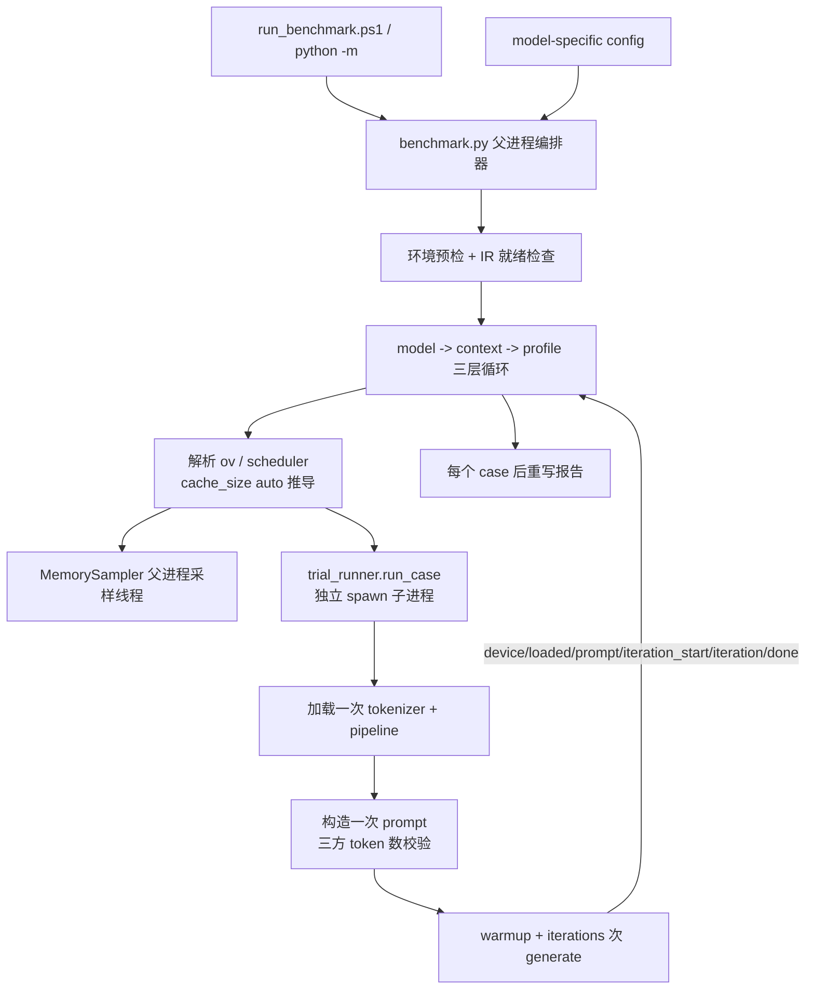

<!--
Copyright (C) 2026 Intel Corporation
SPDX-License-Identifier: Apache-2.0
-->

# Long-Context Benchmark 设计解析

## 1. 文档目的

本文从代码实现角度解析 `components/llm/context_bench/`。使用说明见
[`context_bench_guide.md`](context_bench_guide.md)，本文只讲内部设计、控制流与判定边界。

该组件回答两个问题：

> 1. 给定模型、权重格式和设备，本机能否在内存预算内完成指定长度上下文的 prefill 与 decode？
> 2. **哪一组 OpenVINO 配置最快？**

第二个问题是组件当前形态的原因。它对一组具名 *profile*（KV 精度、prefill 分块大小、
continuous batching 与 stateful pipeline）做基准测试，按 TPOT 优先、TTFT 次优排序，方法学参照
[llm_bench](https://github.com/openvinotoolkit/openvino.genai/tree/master/tools/llm_bench)：
1 次不计入统计的 warmup，N 次测量迭代，报告中位数并附带 min/max。

组件是独立诊断工具，不在生产推理链路中运行：使用两个模型专属 config，不读写主应用配置，
每个 case 在独立子进程中加载模型，结果写入按运行时间戳隔离的目录。

**明确排除**：不是质量评测。一次通过只证明本机能装载模型、处理指定 token 数并产生输出，
不证明模型能准确召回长上下文前部信息。

## 2. 为什么从"容量验证器"重构为"基准工具"

上一版是容量验证器：阶梯扫描 context 长度 → 找到第一个 OOM → 二分细化上限。围绕这个目标
长出了 10 类失败分类、软 SLA 与内存压力组合判定、dry-run 伪试验、CSV schema 退休机制，
`validate_long_context.py` 达 1736 行。

但实际工作重心已转向性能调优，而旧工具在三个方面无法支撑：

**1. 单次观测**。每个测量点只跑一次。§4 记录的全部 A/B 都是手工单次结果，同一 160K 配置
两次跑分别得到 247.0s 和 349.5s（相差 41%）——无法区分配置差异与运行抖动，结论不可证伪。

**2. 无法对比配置**。`pipeline_config` / `scheduler_config` 各只有一组写死的值。换参数要
手工改配置文件重跑，这正是让基准不可复现的那类未提交本地改动。

**3. GPU 预算判定错误**。`_passed()` 用 `peak_gpu_pct_of_budget > 80%` 否决试验，分母是驱动
报告的 `GPU_DEVICE_TOTAL_MEM_SIZE = 33.62 GB`，而 PTL 实际给 iGPU 共享 59 GB。160K /
`cache_size=16` 的 trial **真实完成了 prefill 与 64 token decode**（gen 332.3s，peak GPU
34.2 GB），却被判成 `gpu_memory_limit`，`summary.md` 里 `max_stable_context` 报 0 / FAIL。
代码注释写着该指标 "Reported, deliberately not enforced"，实现却在 enforce——注释与代码矛盾。
35B 模型峰值 39.7 GB 同样远超这个"预算"，进一步说明分母不可用。

重构后：固定 context 多次迭代基准 + profile 矩阵 A/B + 可配 GPU 预算。删除二分细化、
失败分类树、dry-run、CSV 退休机制。

## 3. 目录与职责

```text
components/llm/context_bench/
├── config_qwen3.5_9b.yaml       9B 的 160K profile 矩阵
├── config_qwen3.6_35b_a3b.yaml  35B 的单一 160K TTFT 优化 profile
├── context_builder.py   按目标 token 数精确构造合成课堂转录
├── metrics.py           llm_bench 口径的单次迭代记录与聚合
├── trial_runner.py      单个 (model, profile, context) case 的子进程执行器
├── benchmark.py         CLI 编排器：运行矩阵、内存采样、报告
├── setup_env.ps1        创建后端虚拟环境
└── run_benchmark.ps1    一键入口
```

职责边界使 prompt 构造、指标计算和失败分类都能在没有 OpenVINO、GPU 或真实模型的条件下
单元测试——四个测试文件全部无硬件依赖。

## 4. 调优证据

以下为重构前在实机（Intel Core Ultra X7 358H，64 GB RAM，Intel iGPU，
`openvino-genai 2026.4.0.0.dev20260723`）逐次手工 A/B 得到的实测数据。这些是不可再生的观测，
新 profile 矩阵的取值直接来自它们。**注意：全部为单次观测**，没有中位数——这正是重构引入
迭代机制的原因。

### 4.1 Qwen3.5-9B int8 @ 160K，GPU

| KV | max_num_batched_tokens | cache_size | TTFT | prefill tok/s | 总 generate | Peak RAM | Peak GPU | 结果 |
|---|---:|---:|---:|---:|---:|---:|---:|---|
| u8 | 4096 | 4 | 430.8s | 371.4 | 439.9s | 50.3% / 32.0 GB | 17.6 GB | PASS |
| u8 | 16384 | 4 | 414.2s | 386.3 | 425.0s | 51.5% / 32.7 GB | 19.6 GB | PASS |
| u8 | 32768 | 4 | 395.5s | 404.6 | 404.6s | 57.1% / 36.3 GB | 22.2 GB | PASS |
| f16 | 32768 | 8 | 237.0s | 675.2 | 247.0s | 64.5% | 26.2 GB | PASS（最优） |
| f16 | 32768 | 8 | 338.6s | 472.5 | 349.5s | 67.4% | 26.2 GB | PASS（同配置复跑） |
| f16 | 32768 | 16 | 322.1s | 496.7 | 332.3s | 79.3% | 34.2 GB | 实际成功，被误判 |
| f16 | 32768 | 24 | — | — | — | — | — | load 失败：cache 大于可用内存 |
| f16 | 65536 | 8 | — | — | 304.3s | 73.8% | — | 比 32768 慢；GPU budget 93.3% |
| f16 | 32768 | 未设置(0) | >372s 仍未出首 token | — | — | — | — | 手工终止 |

可提取的结论：

- **瓶颈是 prefill**：TTFT 约占总时间 96%，64 token decode 仅约 10s；报告保留 prefill 与
  e2e throughput 用来解释总等待时间，但按需求以 TPOT 为主排序指标、TTFT 为次排序指标。
- **prefill chunk 的收益在 32768 处饱和**：4096→16384 降低总时间约 3.4%，→32768 累计约 8.0%，
  →65536 反而变慢。
- **f16 KV 优于 u8（对 9B）**：避免量化/反量化开销，TTFT 降低约 32.5%，prefill rate 提高约
  48.1%，代价是约 2 倍 KV 内存，本机仍在 80% RAM 上限内。
- **`cache_size` 是 KV 容量池上限，不是 prefill batch**：增大不增加计算吞吐，只挤压工作区；
  设为 0 让 runtime 自管理反而慢 80s 以上。8 GiB 覆盖 4.93 GiB 的 f16 KV 是合适下界。

### 4.2 Qwen3.6-35B-A3B int8（u8 / 4096 / cache_size=4）

| Context | 总 generate | Peak RAM | Peak GPU | 结果 |
|---:|---:|---:|---:|---|
| 8K | 13.6s | 73.2% | 38.1 GB | PASS |
| 64K | 98.0s | 72.5% | 38.7 GB | PASS |
| 128K | 324.8s | 74.7% | 39.4 GB | PASS |
| 160K | 496.1s | 75.9% | 39.7 GB | PASS |
| 224K | 923.0s | 78.9% | 40.5 GB | PASS |

33 GB 权重加上 KV，160K 时系统 RAM 已达 75.9%。因此 35B 先运行压缩 KV 档以保证容量，
再把 f16 作为 TPOT 对照；本轮 PTL 配置不限制系统内存百分比，但始终报告峰值。

### 4.3 profile 矩阵取值理由

| profile | 依据 |
|---|---|
| `optimized-f16-32k` | 9B 单一配置：TTFT 中位数 244.663s（240.603–247.445s），比 u8/32K 快 30.3%；cache7 覆盖 4.93 GiB f16 KV，并保留充足 prefill 工作区。 |
| 9B 历史 u8/32K | TPOT 略优但 TTFT 中位数 350.792s，比最终 f16/32K 慢 43.4%。 |
| 9B 历史 f16/64K | TTFT 293.746s 且 GPU 31.37 GB，比最终 32K 更慢、更占内存。 |
| `optimized-u8-32k` | 35B 单一配置：TTFT 432.34s，比 16K 快 8.0%；64K/cache3 超过 449s 仍无首 token 且 RAM 达 93.2%，因此回退到实测更快、更稳定的 32K/cache4。 |

`requirements.txt` 固定 `openvino==2026.2.1`，而上述数据产生于 `2026.4.0.0.dev20260723`。
`int4kv` 与 `PERFORMANCE_HINT` 的可用性以实机 runtime 为准，跳过逻辑覆盖版本差异。

## 5. 运行矩阵与控制流



任一 case 失败只记录该点并继续下一个 profile，不中断整轮。

### 5.1 `cache_size: auto` 推导

`auto_cache_size_gb()` 用已有的架构级 KV 估算替换手调魔数：

```
需求 = expected_kv_gb × 1.3
上限 = max(2, gpu_memory_budget_gb − weight_disk_gb − 8)
结果 = clamp(ceil(需求), 2, 上限)
```

- `expected_kv_gb` 由 `theoretical_kv_bytes_per_token()` 按模型 `config.json` 计算，
  **随 profile 的 KV 精度变化**，因此必须按 (model, profile, context) 逐点重算。
- 1.3 的余量覆盖 block 分配的碎片；减去 8 GB 预留 prefill 工作区与 runtime 自身分配。
- 架构未知时返回 None，`cache_size` 被移除、交由 OpenVINO 自管理——猜一个数字比承认不知道更糟。

对 Qwen3.5-9B / f16 / 160K 推导出 7，与手调最优值 8 相邻，而 16 会顶到 34.2 GB、24 直接
load 失败（§4.1）。同一份 profile 定义因此能同时服务 9B 和 35B。

### 5.2 KV 估算只计入 full_attention 层

`theoretical_kv_bytes_per_token()` 只统计 `layer_types` 为 `full_attention` 的层：
`linear_attention` 是 Mamba/GatedDeltaNet 式 O(1) 递归状态，不随序列长度增长。这不只是
config.json 的标签，已直接对照导出 IR 确认——只有 full_attention 层的
`cache_params.past.{key,value}.N` 状态变量带动态序列轴，`linear_attention` 层的
`cache_params.past.{conv,ssm}.N` 在任何上下文长度下形状固定（后者由
`fixed_state_cache_bytes()` 从 IR 单独读出）。Qwen3.5-9B 的 32 层中只有 8 层增长，
按 32 层计会高估 4 倍。

VLM 导出把因果 LM 配置嵌在 `text_config` 下，普通 LLM 在顶层，两种布局都读。

## 6. 单个 case 的执行

### 6.1 加载一次，迭代多次

子进程加载 pipeline 一次，然后对**同一个 prompt** 生成 `warmup + iterations` 次。这与
llm_bench 一致，且有两个必然理由：35B 权重 33 GB，每次迭代重载会主导测量；warmup 需要吸收
惰性权重换页与首次 kernel 编译才有意义。

代价是一个硬约束：**`enable_prefix_caching` 必须为 false**。prompt 复用下，开启前缀缓存会让
warmup 之后的每次迭代命中缓存，报告一个任何首次请求都不会遇到的 TTFT。

### 6.2 父子进程事件协议

| 事件 | 时机 | 父进程动作 |
|---|---|---|
| `device` | 加载前 | 记录驱动报告的 `gpu_budget_driver_gb` 与不被 advertise 的属性 |
| `loaded` | pipeline 构造完成 | 快照构造后内存，作为后续增量基线 |
| `prompt` | context 完成 tokenize | 记录 `prompt_tokens` |
| `iteration_start` | 每次 generate 前 | `sampler.reset_window()` 开新采样窗口 |
| `iteration` | 每次 generate 后 | 附加该窗口的 peak RAM/GPU，回显日志行 |
| `done` | 终态 | 全部记录 + error |

milestone 在到达时即被父进程记录，而非从最终结果读出：被 timeout kill 或 native abort 的
子进程根本不会发 `done`，而"卡在 prefill"与"卡在 decode"是关于同一 context 长度的不同结论。

### 6.3 先上报结果，再 `os._exit(0)`：不析构 pipeline

析构刚完成超长上下文 prefill 的 GPU pipeline 会从析构函数抛出 `ov::Exception`。实机 160K
（紧接一次干净的 128K 通过之后）观测到：

```
openvino_genai.dll!ov::genai::VLMPipeline::~VLMPipeline
  -> openvino.dll!ov::IAsyncInferRequest::~IAsyncInferRequest
  -> openvino_intel_gpu_plugin.dll!...
  -> openvino.dll!ov::Exception::create        <- 从析构函数抛出
  -> ucrtbase.dll!terminate                    <- 上层无法捕获
exit code 3221226505 (0xC0000409)
```

析构函数中逃逸的异常是 `std::terminate`，不是 Python 异常，`try/except` 无法容纳；且旧实现
的析构发生在上报之前，连带销毁了已经算完的测量结果——编排器只看到 `crashed`，无法得知 160K
其实成功了。`_post_and_exit()` 同时修复两半：先 put + close + join_thread 冲刷队列（`os._exit`
会跳过等待 feeder 线程的 atexit 钩子），再 `os._exit(0)` 把回收交给不会抛异常的操作系统。

不析构不泄漏：子进程只跑一个 case，编排器依赖**进程退出**而非 Python 层清理来回收内存，
并在下一个 case 取基线前等待回收落地（`_wait_for_memory_settle`，超时 30s 只告警不阻塞）。

### 6.4 指标来源优先级

1. **优先** `DecodedResults.perf_metrics`——OpenVINO GenAI 自己的测量，也是 llm_bench 读的
   同一来源：`get_ttft()` / `get_tpot()` / `get_generate_duration()` /
   `get_tokenization_duration()` / `get_num_generated_tokens()`。
2. 逐字段回退到 streamer 回调周围的 `perf_counter` 墙钟计时。

逐字段而非整体回退：旧或部分 runtime 构建可能只填一部分，丢弃整条记录会浪费一次数百秒的测量。

`other_tokens_avg_latency` 的分母是 `output_size - 1` 而不是 `output_size`：首 token 由
prefill 产出、已由 TTFT 计入，把它算进 decode 平均会低估每 token decode 成本（旧实现的缺陷）。

### 6.5 prompt token 数三方校验

送入设备前，configured / HuggingFace tokenizer / pipeline 自带的 OpenVINO tokenizer IR
三者必须完全相等，否则直接失败：

$$T_{configured}=T_{HF}=T_{OpenVINO}$$

配置 160,000 却实际产生 160,001 token 是另一个测量。`build_benchmark_prompt()` 通过对整体
prompt 的实测差值迭代校正（最多 5 次）命中精确值，无法收敛时显式报错而非静默接受邻近值。

## 7. 内存采样

### 7.1 在父进程采样

系统 RAM / GPU 计数器是进程级全局的，父进程同样看得到子进程的占用；更关键的是，父进程的读数
在子进程被 timeout kill 时依然存在——而那恰恰是内存最重要的场景（机器在颠簸，不是空闲）。

采样源：`psutil.virtual_memory()`（used / total / percent / available）、Windows
`GlobalMemoryStatusEx` 的 commit 可用量、`monitoring/scripts/windows/collect_gpu` 的 GPU 用量。

### 7.2 低水位是仪表，不是触发器

`min_available_ram_gb` 只记录不干预。早期版本在越过预留阈值时中止试验，把"还剩多少余量"变成
了无法回答的问题——能回答它的那次试验没跑。报告最小值则直接回答：以 7 GB 空闲通过的一步上方
有真实余量，以 0.3 GB 空闲通过的一步已经贴墙。

### 7.3 逐迭代窗口

同一采样流通过 `reset_window()` / `window()` 切分成逐迭代切片，使 warmup 的分配尖峰不会被
计入测量迭代。

## 8. 判定与状态

只有一个硬性内存上限：`max_system_memory_pct`（共享内存 iGPU 上，主机 RAM 才是真正的墙）。
`gpu_memory_budget_gb` 用于推导 `cache_size: auto` 与标记超限，本身不否决 case。

状态取值刻意粗粒度——基准需要知道一个数字是否可用、大致为何不可用，而不需要在六种失败之间
仲裁：`ok` / `memory_limit` / `oom` / `gpu_abort` / `unsupported` / `timeout` / `crashed` /
`load_error` / `error` / `missing_ir`（完整语义见 guide）。

两个刻意的区分：

- **`gpu_abort` 不改写为 `oom`**。OpenCL −14 只说明一条已入队的命令在设备上失败，可能来自
  分配压力、kernel 失败、驱动重置或 TDR。子进程看不到主机空闲 RAM 低水位也看不到 GPU 计数器，
  所以只报告更窄的事实，由父进程独立报告内存压力，而不把相关性写成 OOM 诊断。
- **`unsupported` 不算硬件上限**。老 runtime 不实现 `KV_CACHE_PRECISION=u4` 时报 `oom` 会被
  读成"本机在 160K 做不了 int4 KV"，而事实只是这个构建没有该属性。

`memory_limit` 保留完整数字并降级排序，不删除：越过内存上限的测量仍是对一个不可用配置的真实
测量。

## 9. 输出

每次运行写入 `<output_dir>/<YYYYMMDD-HHMMSS>/`，天然隔离（同时解决旧版"CSV 无 run id"的
已知限制，并让 CSV schema 退休机制成为不必要）：

| 文件 | 内容 |
|---|---|
| `iterations.csv` | 每迭代一行，warmup 含在内并标记，附该迭代的内存窗口 |
| `summary.csv` | 每 (model, profile, context) 一行聚合值 |
| `summary.md` | 按 context 分组的排行榜 + 冠军配置原文 |
| `summary.json` | 同数据的结构化版本，含硬件信息 |

报告在**每个 case 之后**重写而非最后一次性写出：工具的职责就是把机器推到崩溃，而它可能崩得
足以带走编排器。旧版发生过这种情况——没有写出任何 summary，磁盘上仍是上一次 `--dry-run` 的
报告，宣称 160K **PASS**，与刚刚十二分钟真实试验的结论完全相反。看起来是当前结果的过期报告，
比没有报告更糟。`finally` 块在 Ctrl-C 和未处理异常下同样执行，并标记运行未完成。

## 10. 测试设计

| 文件 | 覆盖 |
|---|---|
| `test_context_bench_context_builder.py` | 精确 token 数构造、模板开销扣除、边界漂移校正、pipeline tokenizer 计数 |
| `test_context_bench_kv_estimate.py` | 架构级 KV 估算（hybrid / VLM / 压缩精度）与 `cache_size: auto` 的上下界 |
| `test_context_bench_metrics.py` | llm_bench 字段与单位、TPOT 优先排序、中位数、`perf_metrics` 逐字段回退 |
| `test_context_bench_trial_lifecycle.py` | 子进程退出顺序、父进程回收竞态结果、崩溃仍被上报、失败分类、内存沉降 |

全部不依赖 GPU、模型或 OpenVINO 栈。测试策略上有意包含若干**源码结构断言**（例如
`run_case` 中不得出现 `del pipe`、prompt 必须构造在迭代循环之外）：这些约束的违反不会让任何
功能测试失败，只会让测量悄悄失真，或让进程在几百秒工作之后崩溃。

## 11. 已知限制

1. **不是质量测试**：不验证长距离事实召回或摘要正确性。
2. **系统级内存噪声**：权重与 KV 的拆分是近似差分，机器上的其他活动会计入。
3. **GPU 指标平台相关**：采样器面向 Windows Intel iGPU。
4. **OOM 文本启发式**：未收录的新 runtime 错误文本会落入通用 `error`。
5. **`gpu_memory_budget_gb` 是本机值**：换机器必须修改，工具不自动探测真实共享预算。
6. **输出校验有意较弱**：只要求产生 token，不判断语义——把模型行为变成硬件结论是错的。
7. **profile 之间不共享编译缓存**（除非配置 `cache_dir`），完整矩阵在 160K 上是数小时任务。

## 12. 关键源码索引

| 主题 | 符号 |
|---|---|
| CLI 与配置 | `benchmark.main`, `_parse_args`, `_load_settings`, `_resolve_profiles` |
| 运行矩阵 | `benchmark.main` 三层循环, `_run_case` |
| 子进程控制 | `_run_case_subprocess`, `_crash_reason` |
| 子进程执行 | `trial_runner.run_case`, `_load_pipeline`, `_load_tokenizer` |
| 子进程退出 | `trial_runner._post_and_exit` |
| 指标口径 | `metrics.iteration_record`, `metrics.aggregate`, `trial_runner.read_perf_metrics` |
| 内存采样 | `_read_mem`, `_MemorySampler`, `_wait_for_memory_settle` |
| KV 估算与 cache_size | `theoretical_kv_bytes_per_token`, `fixed_state_cache_bytes`, `auto_cache_size_gb` |
| 状态判定 | `benchmark._status`, `trial_runner.classify_error`, `trial_runner.failing_stage` |
| Prompt 定长 | `context_builder.build_benchmark_prompt` |
| 报告输出 | `write_reports`, `_append_iterations`, `_leaderboard` |
