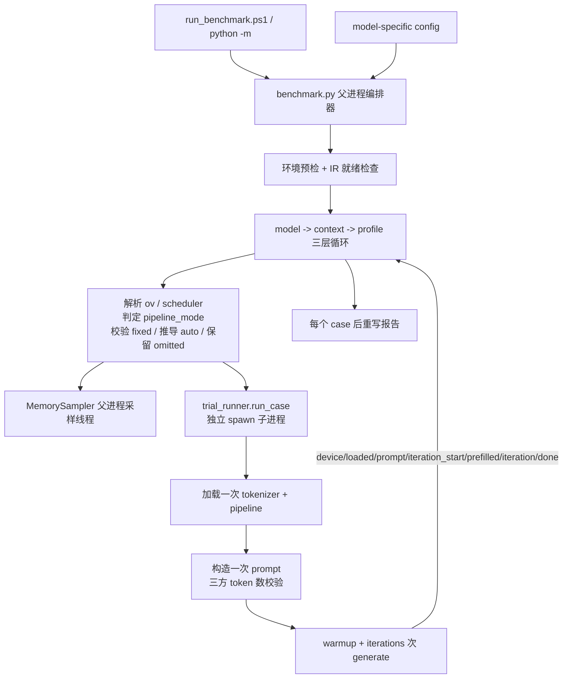

<!--
Copyright (C) 2026 Intel Corporation
SPDX-License-Identifier: Apache-2.0
-->

# Long-Context Benchmark 设计解析

## 1. 文档目的

本文从代码实现角度解析 `components/llm/context_bench/`。使用说明见
[`context_bench_guide.md`](context_bench_guide.md)，本文只讲内部设计、控制流与判定边界。

该组件回答两个问题：

> 1. 给定模型、权重格式和设备，本机能否在内存预算内完成指定长度上下文的 prefill 与 decode？
> 2. **哪一组 OpenVINO 配置最快？**

第二个问题是组件当前形态的原因。它对一组具名 *profile*（KV 精度、prefill 分块大小、
continuous batching 与 stateful pipeline）做基准测试，按 TPOT 优先、TTFT 次优排序，并额外单独
点名 TTFT 最快的 profile（§9）——当前两份配置各自比较的正是 stateful 与 paged 两条管线，而它们
的差异几乎全部发生在 prefill。方法学参照
[llm_bench](https://github.com/openvinotoolkit/openvino.genai/tree/master/tools/llm_bench)：
1 次不计入统计的 warmup，N 次测量迭代，报告中位数并附带 min/max。

组件是独立诊断工具，不在生产推理链路中运行：使用两个模型专属 config，不读写主应用配置，
每个 case 在独立子进程中加载模型，结果写入按运行时间戳隔离的目录。

**明确排除**：不是质量评测。一次通过只证明本机能装载模型、处理指定 token 数并产生输出，
不证明模型能准确召回长上下文前部信息。

## 2. 为什么从"容量验证器"重构为"基准工具"

上一版是容量验证器：阶梯扫描 context 长度 → 找到第一个 OOM → 二分细化上限。围绕这个目标
长出了 10 类失败分类、软 SLA 与内存压力组合判定、dry-run 伪试验、CSV schema 退休机制，
`validate_long_context.py` 达 1736 行。

但实际工作重心已转向性能调优，而旧工具在三个方面无法支撑：

**1. 单次观测**。每个测量点只跑一次。§4 记录的全部 A/B 都是手工单次结果，同一 160K 配置
两次跑分别得到 247.0s 和 349.5s（相差 41%）——无法区分配置差异与运行抖动，结论不可证伪。

**2. 无法对比配置**。`pipeline_config` / `scheduler_config` 各只有一组写死的值。换参数要
手工改配置文件重跑，这正是让基准不可复现的那类未提交本地改动。

**3. GPU 预算判定错误**。`_passed()` 用 `peak_gpu_pct_of_budget > 80%` 否决试验，分母是驱动
报告的 `GPU_DEVICE_TOTAL_MEM_SIZE = 33.62 GB`，而 PTL 实际给 iGPU 共享 59 GB。160K /
`cache_size=16` 的 trial **真实完成了 prefill 与 64 token decode**（gen 332.3s，peak GPU
34.2 GB），却被判成 `gpu_memory_limit`，`summary.md` 里 `max_stable_context` 报 0 / FAIL。
代码注释写着该指标 "Reported, deliberately not enforced"，实现却在 enforce——注释与代码矛盾。
35B 模型峰值 39.7 GB 同样远超这个"预算"，进一步说明分母不可用。

重构后：固定 context 多次迭代基准 + profile 矩阵 A/B + 可配 GPU 预算。删除二分细化、
失败分类树、dry-run、CSV 退休机制。

## 3. 目录与职责

```text
components/llm/context_bench/
├── config_qwen3.5_9b.yaml       9B @160K：stateful 与 paged_min 两个 profile
├── config_qwen3.6_35b_a3b.yaml  35B @160K：stateful 与 paged_min 两个 profile
├── config_qwen3.8_27b.yaml      27B @8K：无 MTP 基线 + num_assistant_tokens 扫描
├── context_builder.py   按目标 token 数精确构造合成课堂转录
├── metrics.py           llm_bench 口径的单次迭代记录与聚合
├── trial_runner.py      单个 (model, profile, context) case 的子进程执行器
├── benchmark.py         CLI 编排器：运行矩阵、内存采样、报告
├── setup_env.ps1        创建后端虚拟环境
└── run_benchmark.ps1    一键入口
```

职责边界使 prompt 构造、指标计算和失败分类都能在没有 OpenVINO、GPU 或真实模型的条件下
单元测试——四个测试文件全部无硬件依赖。

## 4. 调优证据

以下为重构前在实机（Intel Core Ultra X7 358H，64 GB RAM，Intel iGPU，
`openvino-genai 2026.4.0.0.dev20260723`）逐次手工 A/B 得到的实测数据。这些是历史观测，不是
当前配置的验收结果。**注意：多数为单次观测**，不能为后来修改的 profile 参数背书——这正是
重构引入 warmup、重复迭代和中位数的原因。

### 4.1 Qwen3.5-9B int8 @ 160K，GPU

| KV | max_num_batched_tokens | cache_size | TTFT | prefill tok/s | 总 generate | Peak RAM | Peak GPU | 结果 |
|---|---:|---:|---:|---:|---:|---:|---:|---|
| u8 | 4096 | 4 | 430.8s | 371.4 | 439.9s | 50.3% / 32.0 GB | 17.6 GB | PASS |
| u8 | 16384 | 4 | 414.2s | 386.3 | 425.0s | 51.5% / 32.7 GB | 19.6 GB | PASS |
| u8 | 32768 | 4 | 395.5s | 404.6 | 404.6s | 57.1% / 36.3 GB | 22.2 GB | PASS |
| f16 | 32768 | 8 | 237.0s | 675.2 | 247.0s | 64.5% | 26.2 GB | PASS（最优） |
| f16 | 32768 | 8 | 338.6s | 472.5 | 349.5s | 67.4% | 26.2 GB | PASS（同配置复跑） |
| f16 | 32768 | 16 | 322.1s | 496.7 | 332.3s | 79.3% | 34.2 GB | 实际成功，被误判 |
| f16 | 32768 | 24 | — | — | — | — | — | load 失败：cache 大于可用内存 |
| f16 | 65536 | 8 | — | — | 304.3s | 73.8% | — | 比 32768 慢；GPU budget 93.3% |
| f16 | 32768 | 未设置(0) | >372s 仍未出首 token | — | — | — | — | 手工终止 |

可提取的结论：

- **瓶颈是 prefill**：TTFT 约占总时间 96%，64 token decode 仅约 10s；报告保留 prefill 与
  e2e throughput 用来解释总等待时间，但按需求以 TPOT 为主排序指标、TTFT 为次排序指标。
- **prefill chunk 的收益在 32768 处饱和**：4096→16384 降低总时间约 3.4%，→32768 累计约 8.0%，
  →65536 反而变慢。
- **f16 KV 优于 u8（对 9B）**：避免量化/反量化开销，TTFT 降低约 32.5%，prefill rate 提高约
  48.1%，代价是约 2 倍 KV 内存，本机仍在 80% RAM 上限内。
- **`cache_size` 是 KV 容量池上限，不是 prefill batch**：增大不增加计算吞吐，只挤压工作区；
  设为 0 让 runtime 自管理反而慢 80s 以上。8 GiB 覆盖 4.93 GiB 的 f16 KV 是合适下界。

### 4.2 Qwen3.6-35B-A3B int8 历史基线（u8 / 4096 / cache_size=4）

| Context | 总 generate | Peak RAM | Peak GPU | 结果 |
|---:|---:|---:|---:|---|
| 8K | 13.6s | 73.2% | 38.1 GB | PASS |
| 64K | 98.0s | 72.5% | 38.7 GB | PASS |
| 128K | 324.8s | 74.7% | 39.4 GB | PASS |
| 160K | 496.1s | 75.9% | 39.7 GB | PASS |
| 224K | 923.0s | 78.9% | 40.5 GB | PASS |

33 GB 权重加上 KV，160K 时系统 RAM 已达 75.9%。这是 35B 唯一有实测容量背书的档位，而它用的是
u8 KV，因此两个 profile 都沿用 u8——改 f16 会把每 token 的 KV 字节数翻倍（§4.3）。本轮 PTL 配置不限制系统
内存百分比（`max_system_memory_pct: 100`），但始终报告峰值。

### 4.3 当前 profile 与历史证据边界

每份配置现在都是一对 profile，两者 `ov` 完全相同，**唯一变量是管线**：

| 当前 profile | 生效参数 | 与历史证据的关系 |
|---|---|---|
| `stateful`（9B / 35B） | 不写 `scheduler` 段；KV 精度 9B f16、35B u8 | **本机无任何实测**。prefill 变成对 160K 的单次 SDPA pass，没有分页 block 管理也没有可设的池上限；35B 还要在 33 GB 常驻权重之上再放这一次 pass 的注意力工作区，`oom` / `gpu_abort` 本身就是有效结论。 |
| `paged_min`（9B） | f16 KV、`cache_size=8`、`max_num_batched_tokens=32768`、`max_num_seqs=1` | 全部取历史证据最强的点：§4.1 中 f16/32768/cache8 是实测最优（TTFT 237–350s），16 达 34.2 GB、24 直接 load 失败。 |
| `paged_min`（35B） | u8 KV、`cache_size=4`、`max_num_batched_tokens=32768`、`max_num_seqs=1` | u8/cache4 是 §4.2 唯一有容量背书的组合；32768 是该模型筛选过的最佳值（TTFT 432.34s），而 64000 的那次在 `max_num_batched_tokens=64000` 下超时收场（peak RAM 63.5 GB、GPU 59.0 GB / 99.9%）。 |

`max_num_batched_tokens` 在 `paged_min` 中**必须显式写出**：`SchedulerConfig` 的默认值是 **256**，
配合默认开启的 `dynamic_split_fuse`，160K prefill 会被切成约 625 个 chunk——那样测出的差异是
chunk 数量而不是管线差异。

`max_num_seqs: 1` 同样**必须显式写出**，而且理由与并发无关。在 hybrid 模型的分页路径上，
genai 会**按可调度序列数**各预留一份完整的 linear-attention 状态，且这些字节与 KV block 出自
同一个 `cache_size` 池（§5.2）。9B 的该状态为 51 MiB，默认 `max_num_seqs=256` 意味着单是预留就
要 12.75 GB——8 GiB 的池连一个 KV block 都放不下，160K 请求会在**模型加载完成之后**才被判为
`GenerationStatus::IGNORED`（"did not fit in the available cache budget"）。本机 24K 实测：
`cache_size=7` 在 `max_num_seqs=256` 下失败、在 16 下通过，而 `max_num_seqs=1` 时 `cache_size=1`
就够；`cache_size` 低到 1–2 时甚至在构造期就抛 `reserved_la_bytes <= budget_in_bytes`。
`dynamic_split_fuse` 保持默认 true：单条 160K 请求不需要调它。

配置文件是运行矩阵的唯一事实来源；本节只说明证据覆盖到哪里。**profile 的名称不等于性能结论**
——`stateful` 只表示"用哪条管线"，不表示它更快；`paged_min` 的 `min` 指"scheduler 只写必需项"。
只有报告落地后才能比较 TPOT、TTFT 和内存占用。

测试只断言配置文件"当前写着什么"以及测量赖以成立的不变量（精确 160K、
`enable_prefix_caching=false`、两个 profile 的 `ov` 必须逐字相同），不断言历史推荐值——否则调参
会以测试失败的形式出现，而基准存在的意义恰恰是允许调参。其中"`ov` 必须相同"是这一对 profile
特有的不变量：只改其中一个的 KV 精度会让比较悄悄变成双变量实验，而报告无法归因那段 TTFT 差距。

### 4.4 为什么是两个 profile：`cache_size` 与 stateful 不能共存

意图是"用 stateful pipeline，但限制 KV cache 大小"，而在 openvino-genai 2026.4 上这两件事无法
同时成立，核实结果如下：

- `cache_size` 只是 `SchedulerConfig` 的属性（`SchedulerConfig()` 的默认值为
  `cache_size=0` / `num_kv_blocks=0`，即交给 runtime 自管理）。
- 而只要把 `scheduler_config` 传进 `LLMPipeline`/`VLMPipeline`，genai 就切到
  continuous batching / paged attention 后端（`ATTENTION_BACKEND=PA`）。不存在"带
  `SchedulerConfig` 的 stateful pipeline"。
- stateful（SDPA）路径下没有任何可设的 cache 容量上限：本机 GPU 插件
  `SUPPORTED_PROPERTIES` 共 51 项，其中与 KV cache 相关的只有 `KV_CACHE_PRECISION`——它改变的是
  每 token 的字节数，不是总量。KV cache 在这条路径上是随上下文增长的模型 state。

因此"限制 cache_size"和"跑 stateful"是**两个候选配置**，不是一个配置的两项设置，组件把它们做成
一对 profile 一次跑完对比。落到代码上的三处约束：

1. `pipeline_mode(scheduler_config)` 是唯一判据——**scheduler 段是否为空**决定 `stateful` /
   `paged`，该值写入 `summary.csv`、`summary.json` 与 `summary.md` 的 `Pipeline` 列。没有它，
   报告里两行 TTFT 差 100s 却无法说明差在哪。
2. profile 只接受 `{name, ov, scheduler}`，多余的键直接报错。被专门点名的错误是把 `cache_size`
   写在 profile 顶层（以为它能限制 stateful 的 cache）：静默忽略会让几小时的测量跑在作者没有
   要求的配置上。
3. `--scheduler-config` 作用于**每个** profile，会把 `stateful` profile 拖到 paged 后端。这不是
   同一测量的微调而是换了管线，因此显式告警（要扫 scheduler 参数应加 `--profiles paged_min`）。

`requirements.txt` 固定 `openvino==2026.2.1`，而上述数据产生于 `2026.4.0.0.dev20260723`。
`int4kv` 与 `PERFORMANCE_HINT` 的可用性以实机 runtime 为准，跳过逻辑覆盖版本差异。

## 5. 运行矩阵与控制流



任一 case 失败只记录该点并继续下一个 profile，不中断整轮。

### 5.1 `cache_size: auto` 推导

`auto_cache_size_gb()` 用已有的架构级 KV 估算替换手调魔数：

```
需求 = expected_kv_gb × 1.3
上限 = max(2, gpu_memory_budget_gb − weight_disk_gb − 8)
结果 = clamp(ceil(需求), 2, 上限)
```

- `expected_kv_gb` 由 `theoretical_kv_bytes_per_token()` 按模型 `config.json` 计算，
  **随 profile 的 KV 精度变化**，因此必须按 (model, profile, context) 逐点重算。
- `layer_types` 存在但数量与 `num_hidden_layers` 不一致时返回 None；使用残缺元数据低估 KV
  比交给 runtime 自管理更危险。
- 1.3 的余量覆盖 block 分配的碎片；减去 8 GB 预留 prefill 工作区与 runtime 自身分配。
- 架构未知时返回 None，`cache_size` 被移除、交由 OpenVINO 自管理——猜一个数字比承认不知道更糟。

只有 profile 明确写 `cache_size: auto` 时才执行上述推导。当前 `paged_min` 写的是固定值
（9B 为 8、35B 为 4），`stateful` 根本没有 `scheduler` 段——`cache_size` 在那条路径上不存在
（§4.4）。三种状态互不等价：固定值、`auto` 推导、省略后交给 OpenVINO 自管理（后者是第三种可测
配置，而非中性默认：160K 下曾出现 372s 仍无首 token）。作为历史参照，9B / f16 / 160K 的公式
结果为 7，而固定值 16 曾达到 34.2 GB、24 直接 load 失败（§4.1）。

固定值由 `validate_fixed_cache_size()` 校验，且校验点被提到模型之前：`_preflight_cache_sizes()`
在读到该模型 `config.json`、第一个 case 开始加载之前，就把 (profile × context) 全矩阵的固定
`cache_size` 过一遍。只在 `_run_case` 里逐 case 校验会得到两头都不占的结果——一个本来就跑不了的
profile 会在第三个 case 才抛错，而前两个已经花掉几小时；而它是纯算术，第一秒就能判。`auto`
不参与预检：推导出的值不可能小于估算值。

### 5.2 KV 估算只计入 full_attention 层

`theoretical_kv_bytes_per_token()` 只统计 `layer_types` 为 `full_attention` 的层：
`linear_attention` 是 Mamba/GatedDeltaNet 式 O(1) 递归状态，不随序列长度增长。这不只是
config.json 的标签，已直接对照导出 IR 确认——只有 full_attention 层的
`cache_params.past.{key,value}.N` 状态变量带动态序列轴，`linear_attention` 层的
`cache_params.past.{conv,ssm}.N` 在任何上下文长度下形状固定（后者由
`fixed_state_cache_bytes()` 从 IR 单独读出）。Qwen3.5-9B 的 32 层中只有 8 层增长，
按 32 层计会高估 4 倍。

**"不随长度增长"不等于"可以忽略"**：该固定状态不随 context 变大，但在分页路径上按
**可调度序列数**成倍预留，并与 KV block 共享 `cache_size` 池。因此
`expected_kv_gb(..., sequences=)` 会把 `fixed_bytes` 乘以 `max_num_seqs`（stateful 路径恒为
1），`auto_cache_size_gb()` 与 `validate_fixed_cache_size()` 都建立在这个含预留的估算上——这样
"池装不下"能在 load 之前就报错，而不是在模型加载完、prefill 阶段才被 scheduler 丢弃（§4.3）。
9B 的固定状态是 51 MiB，35B-A3B 是 63.75 MiB。

VLM 导出把因果 LM 配置嵌在 `text_config` 下，普通 LLM 在顶层，两种布局都读。

## 6. 单个 case 的执行

### 6.1 加载一次，迭代多次

子进程加载 pipeline 一次，然后对**同一个 prompt** 生成 `warmup + iterations` 次。这与
llm_bench 一致，且有两个必然理由：35B 权重 33 GB，每次迭代重载会主导测量；warmup 需要吸收
惰性权重换页与首次 kernel 编译才有意义。

代价是一个硬约束：**`enable_prefix_caching` 必须为 false**。prompt 复用下，开启前缀缓存会让
warmup 之后的每次迭代命中缓存，报告一个任何首次请求都不会遇到的 TTFT。

### 6.2 父子进程事件协议

| 事件 | 时机 | 父进程动作 |
|---|---|---|
| `device` | 加载前 | 记录驱动报告的 `gpu_budget_driver_gb` 与不被 advertise 的属性 |
| `loaded` | pipeline 构造完成 | 快照构造后内存，作为后续增量基线 |
| `prompt` | context 完成 tokenize | 记录 `prompt_tokens` |
| `iteration_start` | 每次 generate 前 | `sampler.reset_window()` 开新采样窗口 |
| `prefilled` | streamer 收到首 token | 标记 prefill 完成、刷新 timeout；native crash 后仍能定位到 decode |
| `iteration` | 每次 generate 后 | 附加该窗口的 peak 与时间加权 mean RAM/GPU（§7.4），回显日志行 |
| `done` | 终态 | 全部记录 + error |

milestone 在到达时即被父进程记录，而非从最终结果读出：被 timeout kill 或 native abort 的
子进程根本不会发 `done`，而"卡在 prefill"与"卡在 decode"是关于同一 context 长度的不同结论。
`timeout_sec` 是无进度时限；收到任一事件后都会重新计时，避免多次正常长耗时 iteration 被
错误地当成单个超时 case。反过来说，一个 case 里最长的静默区间就是**一次 prefill**，因此
`timeout_sec` 实际上是 TTFT 上限而非整例上限。历史 160K TTFT 为 9B 237–350s、35B 432s（均为
paged + 固定池），warmup 迭代还要额外承担首次 kernel 编译，而 `stateful` 的单次 pass 在本机
毫无实测。因此两份配置的上限刻意放宽（9B 1200s、35B 1800s）：`timeout` 判定只能说明"TTFT 超过
我们随手选的那个数"，对本轮要测的东西没有信息量。
`timeout` 且 `stage_reached: prompt_built` 说明机器仍在 prefill，应先放宽 `timeout_sec`，
而不是判定该 context 长度不可行。

### 6.3 先上报结果，再 `os._exit(0)`：不析构 pipeline

析构刚完成超长上下文 prefill 的 GPU pipeline 会从析构函数抛出 `ov::Exception`。实机 160K
（紧接一次干净的 128K 通过之后）观测到：

```
openvino_genai.dll!ov::genai::VLMPipeline::~VLMPipeline
  -> openvino.dll!ov::IAsyncInferRequest::~IAsyncInferRequest
  -> openvino_intel_gpu_plugin.dll!...
  -> openvino.dll!ov::Exception::create        <- 从析构函数抛出
  -> ucrtbase.dll!terminate                    <- 上层无法捕获
exit code 3221226505 (0xC0000409)
```

析构函数中逃逸的异常是 `std::terminate`，不是 Python 异常，`try/except` 无法容纳；且旧实现
的析构发生在上报之前，连带销毁了已经算完的测量结果——编排器只看到 `crashed`，无法得知 160K
其实成功了。`_post_and_exit()` 同时修复两半：先 put + close + join_thread 冲刷队列（`os._exit`
会跳过等待 feeder 线程的 atexit 钩子），再 `os._exit(0)` 把回收交给不会抛异常的操作系统。

不析构不泄漏：子进程只跑一个 case，编排器依赖**进程退出**而非 Python 层清理来回收内存，
并在下一个 case 取基线前等待回收落地（`_wait_for_memory_settle`，超时 30s 只告警不阻塞）。

### 6.4 指标来源优先级

1. **优先** `DecodedResults.perf_metrics`——OpenVINO GenAI 自己的测量，也是 llm_bench 读的
   同一来源：`get_ttft()` / `get_tpot()` / `get_generate_duration()` /
   `get_tokenization_duration()` / `get_num_generated_tokens()`。
2. 逐字段回退到 streamer 回调周围的 `perf_counter` 墙钟计时。

逐字段而非整体回退：旧或部分 runtime 构建可能只填一部分，丢弃整条记录会浪费一次数百秒的测量。
若 runtime duration 与 streamer TTFT 来自不同计时边界且前者反而更短，TPOT 留空而不是生成负数。

`other_tokens_avg_latency` 的分母是 `output_size - 1` 而不是 `output_size`：首 token 由
prefill 产出、已由 TTFT 计入，把它算进 decode 平均会低估每 token decode 成本（旧实现的缺陷）。

### 6.5 prompt token 数三方校验

送入设备前，configured / HuggingFace tokenizer / pipeline 自带的 OpenVINO tokenizer IR
三者必须完全相等，否则直接失败：

$$T_{configured}=T_{HF}=T_{OpenVINO}$$

配置 160,000 却实际产生 160,001 token 是另一个测量。`build_benchmark_prompt()` 通过对整体
prompt 的实测差值迭代校正（最多 5 次）命中精确值，无法收敛时显式报错而非静默接受邻近值。

唯一的 token 数事实来源是**渲染后的整段 prompt**（`render_prompt()` 一次 `apply_chat_template`
+ 一次 `encode`）：空转录一次得到模板开销，此后每轮校正复用同一个函数。
`build_text_of_token_length()` 因此不再自行回测切片后的文本——decode 后的重新合并只能由整段
prompt 的实测差值发现，多跑一次 160K 量级的 encode 换不来精度。

### 6.6 MTP（multi-token prediction）作为被测变量

部分模型在主网络之外附带一个 **draft head**（Qwen3.8-27B 是同目录下的
`openvino_mtp_model.xml`）。openvino_genai 可以把它当作**自推测解码**运行：draft head 一次
提出 `k` 个候选 token，主模型用一次前向把这 `k` 个一起验证，命中的前缀全部保留。同样的输出
长度下主模型跑的次数变少，TPOT 随之下降。

接入点只有三处，都在 `trial_runner` 里：

```python
# _load_pipeline：同一个目录既是 target 也是 draft——MTP 是自推测，
# genai 自动识别该目录下的 openvino_mtp_model.xml
pipeline_args["draft_model"] = ov_genai.draft_model(model_dir, device)

# generation_config：静态候选数，且必须是 greedy
config = ov_genai.GenerationConfig()  # 每次新建，不继承模型文件中的 sampling 默认值
config.do_sample = False
config.num_return_sequences = 1
config.num_assistant_tokens = k
config.assistant_confidence_threshold = 0.0
```

和 notebook 一样，warmup 使用同一个 prompt 和 MTP 参数，但只生成 4 token；正式迭代才生成
`benchmark.output_tokens`。这样仍能触发首次编译，又不会让每个 profile 的 warmup 多做一整轮 decode。
benchmark 已经提前渲染 chat template 来保证精确 context 长度，因此唯一额外设置是
`apply_chat_template=False`，防止 VLMPipeline 二次套模板。

`validate_mtp()` 是第三处，也是唯一一处纯粹为了**报错时机**而存在的代码。genai 自己同样
会校验这些条件，但校验发生在 `speculative_decoding/continuous_batching/mtp_strategy.cpp`
里，也就是 pipeline 已经加载完之后——对一个 14 GB 的 int4 导出，这意味着每个 case 花掉一分钟
才知道这个 profile 根本跑不起来，而矩阵里的每个 context 还要再花一次。`validate_mtp()` 只做
文件存在性和 dict 检查，代价为零：

| 条件 | 原因 |
|---|---|
| 目录里有 `openvino_mtp_model.xml` | 没有 draft head 就没有东西可推测 |
| profile 必须有 `scheduler` 段（NPU 除外） | 非 NPU 设备上 genai 只在 paged attention 后端跑推测解码；无 `scheduler` 即 stateful/SDPA |
| `num_assistant_tokens >= 1` | genai 断言 `> 0` |
| `assistant_confidence_threshold == 0` | genai 的 MTP 路径只接受**静态**候选数，非零阈值会选中它拒绝的动态变体 |

#### 接受率是怎么来的

当前 genai 在 `result.extended_perf_metrics.get_draft_acceptance_rate()` 直接暴露 draft
接受率，报告优先使用这个公开指标。验证步数仍没有公开 getter；为了同时报告每次主模型前向
实际产出的 token 数，兼容路径读取 `perf_metrics.raw_metrics.m_new_token_times`（每次主模型
前向一条，而非每 token 一条）：

$$\text{tokens per step}=\frac{\text{output\_size}}{\text{len}(m\_new\_token\_times)}$$

不能用 $(\text{tokens per step}-1)/k$ 代替官方接受率：verification step 的边界和 draft
批次并非严格一一对应。本机 k=3 的步数公式约为 46%，而公开计数给出 51%。旧 runtime 没有
`ExtendedPerfMetrics` 时，接受率报告为空，而不是展示一个看似精确的估算值。

关闭 MTP 时该式恒等于 1.00 tok/step——这正好成为**基线行的自检**：基线读数不是 1.00 就说明
MTP 漏进了对照组，那一轮所有的加速比都不成立。

本机实测（GPU，8K prompt，64 output tokens，复用同一个 pipeline）：

| profile | TPOT ms | 接受率 |
|---|---:|---:|
| `mtp_k1` | 197.2 | 63.2% |
| `mtp_k2` | 156.8 | 61.8% |
| `mtp_k3` | **150.9** | **50.7%** |
| `mtp_k4` | 152.0 | 41.3% |
| `mtp_k6` | 161.3 | 30.2% |

k=2 是高接受率平衡档，k=3 是最低 TPOT 档；继续提高 k 会让更多候选被验证后丢弃，接受率和
TPOT 都变差。MTP 路径要求 `assistant_confidence_threshold=0`，所以不能靠动态阈值改善同一个
k；有效操作是降低 `num_assistant_tokens` 并重新比较 TPOT。低于 60% 时控制台会建议下一个
较小的 k。

和官方 notebook 一样，完整 baseline + MTP sweep 还比较 greedy 输出的 SHA-256。任何 MTP
输出与 baseline 不一致时，报告会明确警告，避免把改变输出得到的速度误认为有效加速。

MTP 只影响 decode：prefill 仍然把整段 context 走一遍，因此不要用 TTFT 判断 k 的优劣。

#### KV 估算

draft head 与主模型并行运行，在**同一段 context 上维护自己的 KV**，且出自同一个
`cache_size` 池。`mtp_head_layers()` 从 IR 里数 `past_key_values.N.key` 变量（不假设是 1，
`mtp_num_hidden_layers` 在别的 MTP 模型上会更大），`expected_kv_gb()` 在 MTP 打开时按主模型
同样的 `num_key_value_heads × head_dim` 加上这几层。Qwen3.8-27B 上是 16 个 full_attention
层之外多 1 层，约 +6%——不大，但 `cache_size: auto` 必须按两个模型实际分配的量来推导，否则
基线和 MTP 行会用同一个偏小的池。

## 7. 内存采样

### 7.1 在父进程采样

系统 RAM / GPU 计数器是系统级全局的，父进程同样看得到子进程的占用；更关键的是，父进程的读数
在子进程被 timeout kill 时依然存在——而那恰恰是内存最重要的场景（机器在颠簸，不是空闲）。

采样源只有两个，都在 `_read_mem()` 内、各自 best-effort：`psutil.virtual_memory()`
（used / percent / available）与 `monitoring/scripts/windows/collect_gpu.get_gpu_memory_total()`
的 GPU 用量。任一不可用时该字段保持 None（见 §8），不退化为 0。

### 7.2 低水位是仪表，不是触发器

`min_available_ram_gb` 只记录不干预。早期版本在越过预留阈值时中止试验，把"还剩多少余量"变成
了无法回答的问题——能回答它的那次试验没跑。报告最小值则直接回答：以 7 GB 空闲通过的一步上方
有真实余量，以 0.3 GB 空闲通过的一步已经贴墙。

### 7.3 逐迭代窗口

同一采样流通过 `reset_window()` / `window()` 切分成逐迭代切片，使 warmup 的分配尖峰不会被
计入测量迭代。

### 7.4 峰值与均值：两个不可互换的问题

只报峰值无法区分"碰了一下 40 GB"与"整整六分钟压着 40 GB"，而在 59 GB 共享预算里这恰恰是最关键
的区别。因此每个 case 同时报告两组数字：

| 指标 | 覆盖范围 | 回答的问题 |
|---|---|---|
| `peak_ram_gb` / `peak_gpu_gb` | 整个 case（含 load） | 这台机器**能不能**跑这个配置。由 prefill 的瞬时工作区决定，是判定 `gpu_budget_exceeded` 的依据 |
| `mean_ram_gb` / `mean_gpu_gb` | 仅测量迭代（不含 load、不含 warmup） | 这个配置在**真正运行的那几分钟里**占多少。当同一预算还要装应用其余部分时，这才是可用的数字 |

均值是**按时间加权**的（`_TimeWeightedMean`），不是样本算术平均。原因是采样并非等间隔：
`_read_mem()` 是一次 PDH 查询，耗时数十毫秒且随负载波动，算术平均会让"恰好返回得快"的读数
拿到与"停留了两倍时长"的读数相同的权重。按时间加权同时带来一个必要性质——**结果与采样间隔
无关**，改 `interval` 不会改变数字，否则跨运行无法比较。

计数器不可用时不计入权重（而非按 0 计入），与 `_fold` 一致；窗口短于一个采样间隔时没有时长可
加权，此时报告当前读数——一个样本仍然是一次测量。

case 级的 `mean_*` 取各测量迭代窗口均值的**中位数**，与其余指标的聚合方式一致；`peak_*` 保持为
整个 case 的高水位，两者不是同一个 accumulator。**不提供整个 case 的均值**：那会把 load 阶段
平均进来，描述的既不是加载也不是推理。

`mean_gpu_pct_of_budget` 与 `peak_gpu_pct_of_budget` 对称。峰均差距大说明负载尖锐，**不等于**
它便宜。

## 8. 判定与状态

有两个配置内存上限：`max_system_memory_pct` 与 `gpu_memory_budget_gb`。后者必须是有限正数。
完成测量但越过任一上限的
case 保留全部数字，分别降级为 `memory_limit` / `gpu_memory_limit` 并排除排名；驱动报告的
`GPU_DEVICE_TOTAL_MEM_SIZE` 只作为参考列，不参与判定。

RAM 或 GPU 采样不可用时保持 None，不伪装成 0。即使 generation 成功，该 case 也降级为
`measurement_error` 并排除排名，因为“在预算内”必须建立在两个预算都实际测量的基础上。

状态取值刻意粗粒度——基准需要知道一个数字是否可用、大致为何不可用：`ok` /
`memory_limit` / `gpu_memory_limit` / `measurement_error` / `oom` / `gpu_abort` /
`unsupported` / `timeout` /
`crashed` / `load_error` / `error` / `missing_ir`（完整语义见 guide）。

两个刻意的区分：

- **`gpu_abort` 不改写为 `oom`**。OpenCL −14 只说明一条已入队的命令在设备上失败，可能来自
  分配压力、kernel 失败、驱动重置或 TDR。子进程看不到主机空闲 RAM 低水位也看不到 GPU 计数器，
  所以只报告更窄的事实，由父进程独立报告内存压力，而不把相关性写成 OOM 诊断。
- **`unsupported` 不算硬件上限**。老 runtime 不实现 `KV_CACHE_PRECISION=u4` 时报 `oom` 会被
  读成"本机在 160K 做不了 int4 KV"，而事实只是这个构建没有该属性。

两个 memory-limit 状态都保留完整数字并排除排序，不删除：越过预算的测量仍是对一个不可用配置
的真实测量。

## 9. 输出

每次运行写入 `<output_dir>/<YYYYMMDD-HHMMSS>/`，天然隔离（同时解决旧版"CSV 无 run id"的
已知限制，并让 CSV schema 退休机制成为不必要）：

| 文件 | 内容 |
|---|---|
| `iterations.csv` | 每迭代一行，warmup 含在内并标记，附该迭代的内存窗口 |
| `summary.csv` | 每 (model, profile, context) 一行聚合值，含 `pipeline_mode` 与 `cache_size_gb` |
| `summary.md` | 按 context 分组的排行榜（带 `Pipeline` 列）+ TTFT 最快项单独点名 + TPOT 冠军配置原文 |
| `summary.json` | 同数据的结构化版本，含硬件信息 |

TPOT 排行第一名与 TTFT 最快项**可以是不同的 profile**，两者都打印正是为此：160K 下 TTFT 约占墙钟
96%，一个 TPOT 略优但首 token 慢 100s 的 profile 不是该上线的那个（`_leaderboard` /
`_ttft_leaderboard`）。

报告在**每个 case 之后**重写而非最后一次性写出：工具的职责就是把机器推到崩溃，而它可能崩得
足以带走编排器。旧版发生过这种情况——没有写出任何 summary，磁盘上仍是上一次 `--dry-run` 的
报告，宣称 160K **PASS**，与刚刚十二分钟真实试验的结论完全相反。看起来是当前结果的过期报告，
比没有报告更糟。`finally` 块在 Ctrl-C 和未处理异常下同样执行，并标记运行未完成。

## 10. 测试设计

| 文件 | 覆盖 |
|---|---|
| `test_context_bench_context_builder.py` | 精确 token 数构造、模板开销扣除、边界漂移校正、pipeline tokenizer 计数 |
| `test_context_bench_kv_estimate.py` | 架构级 KV 估算（hybrid / VLM / 压缩精度）、linear-attention 状态按 `max_num_seqs` 预留、`cache_size: auto` 上下界、两份配置的不变量（§4.3：profile 对、`ov` 逐字相同、stateful 无 scheduler、paged 有池上限且 `max_num_seqs=1`） |
| `test_context_bench_metrics.py` | llm_bench 字段与单位、配置校验（含 profile 未知键、override 换管线告警）、TPOT 优先排序与 TTFT 排序、`pipeline_mode` 落库、中位数、时间加权均值（权重、缺失计数器、采样率无关性）、`perf_metrics` 逐字段回退 |
| `test_context_bench_trial_lifecycle.py` | 子进程退出顺序、prefill milestone、父进程回收竞态结果、失败分类、内存沉降 |

全部不依赖 GPU、模型或 OpenVINO 栈。测试策略上有意包含若干**源码结构断言**（例如
`run_case` 中不得出现 `del pipe`、prompt 必须构造在迭代循环之外）：这些约束的违反不会让任何
功能测试失败，只会让测量悄悄失真，或让进程在几百秒工作之后崩溃。

## 11. 已知限制

1. **不是质量测试**：不验证长距离事实召回或摘要正确性。
2. **系统级内存噪声**：权重与 KV 的拆分是近似差分，机器上的其他活动会计入。
3. **GPU 指标平台相关**：采样器面向 Windows Intel iGPU。
4. **OOM 文本启发式**：未收录的新 runtime 错误文本会落入通用 `error`。
5. **`gpu_memory_budget_gb` 是本机值**：换机器必须修改，工具不自动探测真实共享预算。
6. **输出校验有意较弱**：只要求产生 token，不判断语义——把模型行为变成硬件结论是错的。
7. **profile 之间不共享编译缓存**（除非配置 `cache_dir`），完整矩阵在 160K 上是数小时任务。
8. **新架构可能在加载阶段原生崩溃，而非报出可分类的错误**：这曾经是
   `config_qwen3.8_27b.yaml` 的状态——在 `openvino_genai 2026.4.0.0.dev20260723` 上，
   Qwen3.8-27B（`qwen3_5` 混合注意力 VLM）无论 `stateful`/`paged_min`、GPU/CPU、还是上下文
   长度，都在 `VLMPipeline` 构造阶段崩溃
   （`crashed:exitcode=3221225477:0xC0000005 STATUS_ACCESS_VIOLATION`），发生在本工具能
   控制的任何配置之前，因而无法用 Python 侧配置规避。
   **该结论已不再成立**：在 `openvino 2026.5.0` / `openvino-genai 2026.5.0.0-3416` 上，用
   官方发布的 `OpenVINO/Qwen3.8-27B-int4-ov` IR，模型约 50 s 加载完成并正常生成，开不开 MTP
   都可以。保留这一条是因为**失败模式**本身仍然存在：一个 runtime reader 没适配过的图结构
   会以原生崩溃而不是干净异常的形式出现，`crashed` 状态和 `stage_reached` 是唯一的线索。
9. **MTP 只能跑在 paged 后端上**：非 NPU 设备上 genai 只在 paged attention 上支持推测解码，
   所以 stateful profile 无法携带 MTP，"stateful vs paged" 与 "MTP vs 无 MTP" 这两个对比
   无法在同一个矩阵里正交展开。`config_qwen3.8_27b.yaml` 因此六个 profile 全是 paged。

## 12. 关键源码索引

| 主题 | 符号 |
|---|---|
| CLI 与配置 | `benchmark.main`, `_parse_args`, `_load_settings`, `_resolve_profiles` |
| 管线选择 | `pipeline_mode`, `PIPELINE_STATEFUL`, `PIPELINE_PAGED`, `trial_runner._load_pipeline` |
| MTP 接入与校验 | `benchmark._resolve_mtp`, `trial_runner.validate_mtp`, `has_mtp_head`, `MTP_MODEL_FILE`, `_load_pipeline` 的 `draft_model`, `generation_config` |
| MTP 产出指标 | `metrics.mtp_yield`, `read_perf_metrics` 的 `verification_steps`, `benchmark._mtp_cell`, `_mtp_speedup` |
| 模型目录覆盖 | `benchmark._model_ir_dir`, config 的 `model.model_dirs` |
| 运行矩阵 | `benchmark.main` 三层循环, `_run_case` |
| 子进程控制 | `_run_case_subprocess`, `_crash_reason` |
| 子进程执行 | `trial_runner.run_case`, `_load_pipeline`, `_load_tokenizer` |
| 子进程退出 | `trial_runner._post_and_exit` |
| 指标口径 | `metrics.iteration_record`, `metrics.aggregate`, `trial_runner.read_perf_metrics` |
| 内存采样 | `_read_mem`, `_MemorySampler`, `_wait_for_memory_settle` |
| KV 估算与 cache_size | `theoretical_kv_bytes_per_token`, `fixed_state_cache_bytes`, `mtp_head_layers`, `auto_cache_size_gb` |
| 状态判定 | `benchmark._status`, `trial_runner.classify_error`, `trial_runner.failing_stage` |
| Prompt 定长 | `context_builder.build_benchmark_prompt`, `render_prompt` |
| 报告输出 | `write_reports`, `_append_iterations`, `_leaderboard`, `_ttft_leaderboard` |
