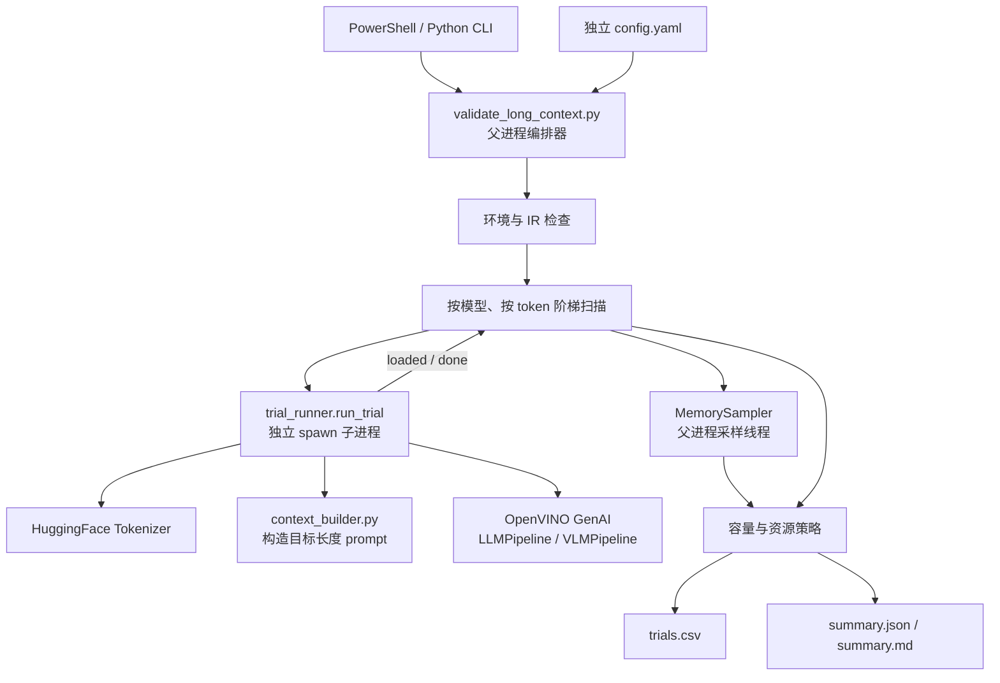
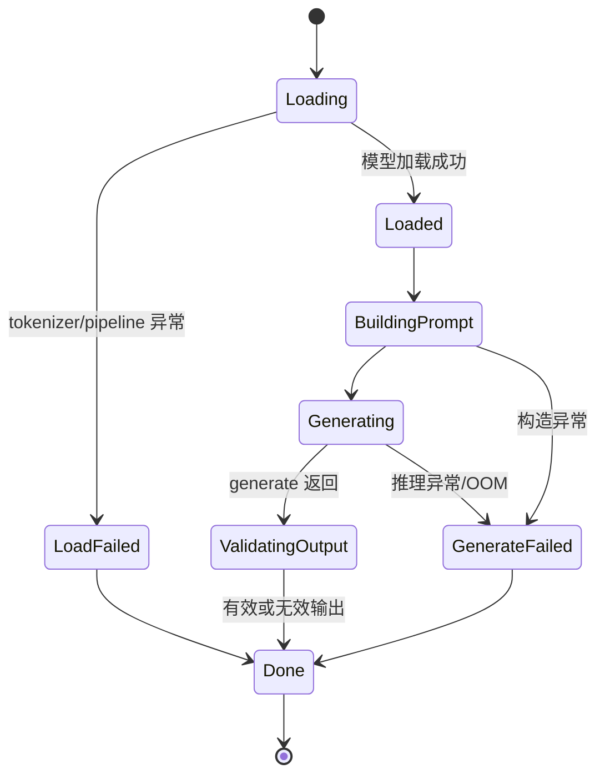
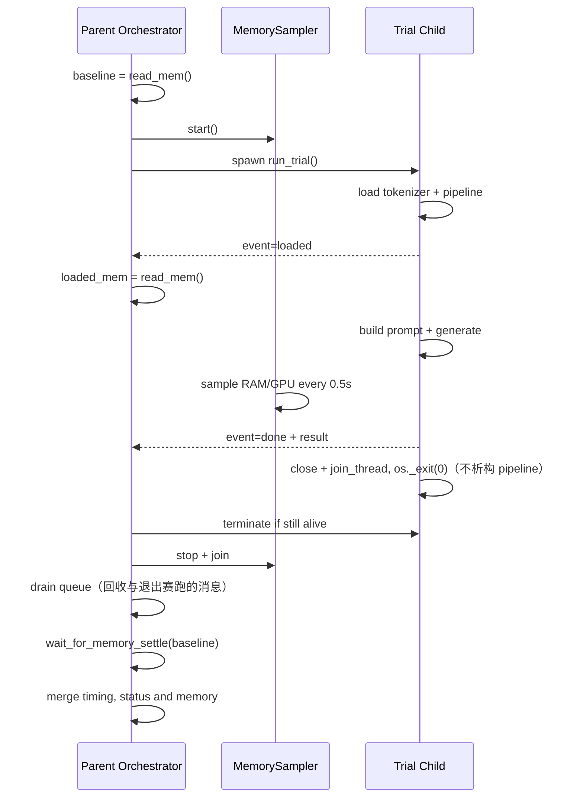
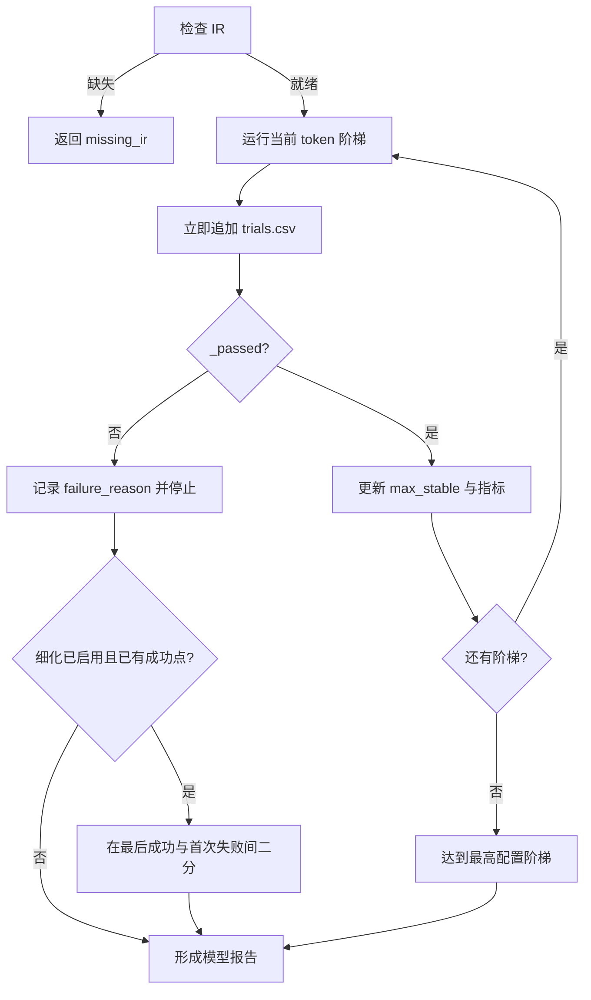

<!--
Copyright (C) 2026 Intel Corporation
SPDX-License-Identifier: Apache-2.0
-->

# Context Validation 功能组件设计解析

## 1. 文档目的

本文从代码实现角度解析 `components/llm/context_validation/`。该组件用于回答：

> 对给定模型、OpenVINO 权重格式、推理设备和目标硬件，能够稳定完成 prefill 并继续 decode 的最大上下文长度是多少？该长度是否达到目标值？

这里的 `context validation` 是**硬件容量验证**，不是长文本理解质量评测。一次通过只证明当前机器能够装载模型、处理指定 token 数的提示词，并产生少量有效输出；它不证明模型能够准确回忆长上下文前部的信息，也不评价摘要质量。

组件是独立诊断工具，不在生产推理链路中运行：

- 使用自己的 `components/llm/context_validation/config.yaml`；
- 不读取或修改主应用的 `smart-classroom/config.yaml`；
- 每次试验在独立子进程中加载模型；
- 将逐次原始结果与模型级汇总写入独立输出目录。

现有 `validate_long_context.md` 更侧重使用和环境准备，本文重点说明内部设计、控制流、数据流、判定逻辑与实现边界。

## 2. 目录与职责

```text
components/llm/context_validation/
├── config.yaml
├── context_builder.py
├── trial_runner.py
├── validate_long_context.py
├── setup_env.ps1
└── run_validate_long_context.ps1
```

| 文件 | 核心职责 |
|---|---|
| `validate_long_context.py` | CLI 编排器；加载配置、扫描模型与上下文阶梯、管理子进程、采样内存、执行通过策略、写报告。 |
| `trial_runner.py` | 单次试验执行器；在子进程中加载 tokenizer 和 OpenVINO pipeline，构造提示词、执行生成并验证输出。 |
| `context_builder.py` | 合成长课堂转录文本，并根据目标 token 数扣除聊天模板开销，使最终 prompt 尽量命中目标长度。 |
| `config.yaml` | 组件私有配置；定义候选模型、目标长度、扫描阶梯、SLA、超时和输出目录。 |
| `run_validate_long_context.ps1` | 一键入口；定位并激活后端虚拟环境，将工作目录切换到 `smart-classroom/` 后启动 Python 模块。 |
| `setup_env.ps1` | 创建或复用仓库后端虚拟环境，并安装 `requirements.txt`。 |

三个 Python 文件形成明确的职责边界：

1. `context_builder.py` 只处理“输入规模”；
2. `trial_runner.py` 只处理“一次真实推理”；
3. `validate_long_context.py` 处理“多次试验的生命周期、策略和报告”。

这种拆分使 prompt 构造和策略判断可在没有 OpenVINO、GPU 或真实模型的条件下单元测试。

## 3. 总体架构



设计的关键不是简单调用一次 `generate()`，而是把不稳定的硬件试验包装成可恢复、可度量的扫描过程：

- 子进程承受 OOM、驱动异常和挂起风险；
- 父进程在子进程之外保留超时控制和峰值数据；
- 阶梯扫描定位粗粒度上限；
- 可选二分细化缩小最后成功与首次失败之间的区间；
- 原始数据与汇总数据分开保存，便于复核。

## 4. 启动与配置解析

### 4.1 PowerShell 启动链

推荐入口是 `run_validate_long_context.ps1`：

```text
run_validate_long_context.ps1
  ├─ 根据脚本路径定位 smart-classroom/
  ├─ 定位同级虚拟环境 ../smartclassroom/Scripts/python.exe
  ├─ 虚拟环境不存在时调用 setup_env.ps1
  ├─ 激活虚拟环境
  ├─ Set-Location smart-classroom/
  └─ python -m components.llm.context_validation.validate_long_context <args>
```

切换工作目录很重要，因为默认 `models_base_path` 和 `output_dir` 都是相对 `smart-classroom/` 的路径。

### 4.2 CLI 与配置合并

`main()` 首先解析参数。除 `trial_timeout_sec` 外，大部分试验参数都可通过 CLI 覆盖。`_load_settings()` 用以下优先级生成普通字典：

```text
显式 CLI 参数 > 组件私有 config.yaml > 代码中的兼容默认值
```

其中 `probe_tokens`、`max_generate_time_sec`、`gpu_memory_pressure_pct` 使用 `getattr(..., default)` 保留旧配置兼容性；候选模型、目标 token、阶梯和超时要求配置中存在。

`context_steps_tokens` 会排序，但实现不会去重，也不主动校验空列表、负值或目标值是否包含在阶梯中。因此配置应满足：

- 至少有一个正整数阶梯；
- 阶梯覆盖目标值及其上方的一个或多个点；
- `trial_timeout_sec` 大于 `max_generate_time_sec`，以便慢试验有机会返回诊断信息；
- 目标模型、设备和权重格式与计划部署环境一致。

### 4.3 环境预检

真实运行时，`_preflight_environment_check()` 使用 `importlib.util.find_spec()` 检查 `openvino_genai` 和 `transformers`。缺失时直接给出虚拟环境和启动脚本提示，避免每个扫描点重复失败。

`--dry-run` 跳过此检查。`trial_runner.py` 也将 OpenVINO 和 Transformers 放在函数内延迟导入，因此仅导入编排模块或运行 dry-run 不要求安装完整推理栈。

## 5. 模型发现与 Pipeline 选择

### 5.1 模型目录约定

`_model_ir_dir()` 按生产模型工具的路径约定构造目录：

```text
<models_base_path>/<provider>/<model_name.replace('/', '_')>_<weight_format>
```

例如：

```text
models/openvino/Qwen_Qwen3.5-9B_int8
```

### 5.2 IR 就绪检查

`_ir_ready()` 递归扫描 XML 文件，并要求同时存在：

- 一个匹配 `openvino*_model*.xml` 的模型 IR；
- `openvino_tokenizer.xml`；
- `openvino_detokenizer.xml`。

如果缺失，当前模型不进入扫描，而是返回 `status=missing_ir`，并通过 `_prep_command()` 生成可执行的 `optimum-cli export openvino` 命令。模型转换没有被隐式放入验证流程，因为大模型转换耗时、占用磁盘大，自动转换会使扫描时长和失败边界不可预测。

### 5.3 LLM/VLM 自适应

`trial_runner._load_pipeline()` 根据根目录文件选择 OpenVINO GenAI pipeline：

| IR 文件 | Pipeline |
|---|---|
| `openvino_language_model.xml` | `ov_genai.VLMPipeline` |
| `openvino_model.xml` | `ov_genai.LLMPipeline` |

两者都暴露 `generate(prompt, generation_config=...)`，因此后续试验流程不关心模型架构。

GPU 设备会附加 `GPU_ENABLE_LARGE_ALLOCATIONS=YES`，CPU 则使用空的 OpenVINO 配置。

注意：`_ir_ready()` 递归检查目录，而 `_load_pipeline()` 只检查模型目录根部。这符合当前导出布局，但若未来允许 IR 嵌套存放，两处规则需要同步调整。

## 6. Prompt 构造算法

### 6.1 为什么使用合成课堂转录

容量试验关心 token 体积，而不是固定语料的语义。组件内置多轮 `TEACHER` / `STUDENT_NN` 对话并循环扩展，原因是：

- 对话形式接近真实课堂摘要输入；
- 多样文本比重复单词更接近真实 tokenizer 合并行为；
- 不依赖外部数据文件，试验可重复；
- 最终仍带有明确任务，模型能够生成可验证的自然语言。

### 6.2 `build_text_of_token_length()`

算法过程如下：

1. 使用目标模型 tokenizer 对内置语料编码，不添加特殊 token；
2. 计算语料重复次数，确保编码后长度不小于目标值；
3. 将完整重复文本重新编码并截取前 `target_tokens` 个 token id；
4. 将 token id 解码回文本；
5. 再次编码解码后的文本，得到真实可见的 `actual_token_count`。

形式化表示为：

$$
r = \left\lfloor \frac{T}{|E(C)|} \right\rfloor + 1
$$

$$
I = E(C^r)[:T], \quad X = D(I), \quad T_{actual}=|E(X)|
$$

其中 $T$ 是目标正文 token 数，$C$ 是内置语料，$E$ 和 $D$ 分别是 tokenizer 的 encode 和 decode。

encode/decode 不一定严格互逆，因此实现返回重新编码后的实际值，而不是假设切片长度就是最终文本长度。

### 6.3 扣除聊天模板开销

目标值指完整 prefill prompt，而不仅是课堂正文。`build_context_prompt()` 先构造空正文消息，并由 `measure_template_overhead()` 计算以下固定部分的 token 开销：

- system prompt；
- user 前缀和后缀；
- role 标记及其他 chat template token；
- generation prompt。

正文预算为：

$$
T_{content}=\max(0, T_{target}-T_{overhead})
$$

随后将合成正文、固定前后缀和 system prompt 重新套入聊天模板，最终再次编码得到 `prompt_tokens`。

模板参数固定为：

```python
add_generation_prompt=True
enable_thinking=False
```

关闭 thinking 能减少模型隐式推理模式对探针输出和时延的干扰。对于 encode/decode 稳定的 tokenizer，测试要求精确命中目标；真实 tokenizer 可能因边界合并而有少量偏差，因此报告同时保存 `tokens_requested` 和 `prompt_tokens`。

## 7. 单次试验流程

### 7.1 子进程状态机

每个 `(model, context_tokens)` 组合都调用一次 `trial_runner.run_trial()`：



详细步骤：

1. 加载 HuggingFace tokenizer；
2. 根据 IR 类型加载 `LLMPipeline` 或 `VLMPipeline`；
3. 记录 `load_time_s`，发送 `loaded` 事件；
4. 构造目标长度 prompt；
5. 创建 greedy `GenerationConfig(max_new_tokens=probe_tokens, do_sample=False)`；
6. 调用 `pipe.generate()`，记录完整 prefill + decode 耗时；
7. 验证输出并计算生成 token 数；
8. 发送 `done` 事件、冲刷队列；
9. 直接 `os._exit(0)`，**不析构 pipeline**（见 §7.5）。

`generate_time_s` 包含长 prompt 的 prefill 和短输出的 decode，因此：

$$
tokens\_per\_second = \frac{generated\_tokens}{generate\_time\_s}
$$

只是端到端诊断指标，不是纯 decode 吞吐率。

### 7.2 Tokenizer 兼容回退

OpenVINO 导出的 tokenizer 配置可能出现两类兼容问题：

- `extra_special_tokens` 类型与 Transformers 预期不一致；
- `tokenizer_class` 名称不能被 `AutoTokenizer` 解析。

`_load_tokenizer()` 按顺序尝试四种组合：

```text
AutoTokenizer
AutoTokenizer + extra_special_tokens={}
PreTrainedTokenizerFast
PreTrainedTokenizerFast + extra_special_tokens={}
```

仅对 `ValueError` 和 `AttributeError` 回退，其他异常直接进入加载失败处理。这里的 Transformers tokenizer 只负责 prompt 定长和输出计数，真实推理由 OpenVINO IR 中的 tokenizer 完成。

### 7.3 输出有效性检查

组件不评价答案正确性，但要求 pipeline 确实产生最低限度的自然语言输出。`_validate_generated_output()` 依次拒绝：

| 条件 | 错误值 |
|---|---|
| 空字符串或纯空白 | `no_output` |
| tokenizer 编码结果为空 | `no_output_tokens` |
| 去除特殊 token 后为空 | `special_tokens_only` |
| 含 Unicode replacement character 或非法控制字符 | `invalid_characters` |
| 字母数字字符少于 3 个 | `no_semantic_output` |
| 所有字母数字字符忽略大小写后完全相同 | `repetitive_output` |

该规则能过滤 `!!!!`、`<eos>`、`aaaaaaaa` 等假成功，又避免引入任务相关的语义评分。

### 7.4 错误编码

加载或生成抛出的异常被编码为：

```text
<stage>:<classification>:<detail>
```

示例：

```text
load:oom:out of memory
generate:exception:unsupported operation
```

`_classify_error()` 用两组文本标记分类，其余异常归为 `exception`。父进程只读取第二段分类字段，避免异常 detail 中出现 `oom` 字样或额外冒号造成误判。

到达容量上限时抛出的异常来自 GPU 插件而不是 Python，以 `ov::Exception` 的纯文本形式传上来；而且 OpenCL 是在下一个同步点才报告「已入队命令在设备上失败」，所以消息里出现的是等待函数名，从头到尾不会提到内存：

```text
Exception from src\plugins\intel_gpu\src\runtime\ocl\ocl_memory.cpp:591:
[GPU] clWaitForEvents, error code: -14 CL_EXEC_STATUS_ERROR_FOR_EVENTS_IN_WAIT_LIST
```

因此两组标记按「这条消息到底证明了什么」划分：

| 分类 | 标记 | 含义 |
|---|---|---|
| `oom` | `out of memory`、`allocation failed`、`bad_alloc`、`cannot allocate`、`CL_MEM_OBJECT_ALLOCATION_FAILURE`、`CL_OUT_OF_HOST_MEMORY`、`CL_INVALID_BUFFER_SIZE` 等 | 分配确实没有发生 |
| `gpu_abort` | `CL_EXEC_STATUS_ERROR_FOR_EVENTS_IN_WAIT_LIST`(-14)、`CL_OUT_OF_RESOURCES`(-5)、`CL_INVALID_COMMAND_QUEUE`(-36)、`clWaitForEvents`、`clFinish` | 设备接受了命令后又杀掉了它 |

在共享内存 iGPU 上 `gpu_abort` 通常就是内存耗尽，但驱动复位（TDR）会给出同样的错误码，而子进程既看不到宿主机的空闲内存低水位也读不到 GPU 计数器——这两者都由父进程采样。所以子进程只上报它能确认的窄事实，由父进程结合实测内存决定是否升级为 `oom`（§10.2）。

### 7.5 先上报结果，再 `os._exit(0)`：不析构 pipeline

子进程的每一条退出路径都走 `_post_result_and_exit()`：**先** `put(done)` → `close()` → `join_thread()`，**再** `os._exit(0)`。既不 `del pipe`，也不 `gc.collect()`。这不是省事，而是对一次真实崩溃的正面修复。

**现象**：在 64 GB 共享内存 iGPU 机器上，`Qwen/Qwen3.5-9B` 的 128K 阶梯干净通过，紧接着的 160K 阶梯整个子进程被终止，退出码 `3221226505`（`0xC0000409`），并打印一段由 PyTorch `c10/util/AbortHandler.h` 输出的原生调用栈（transformers 会引入 torch，torch 在 Windows 上默认安装自定义 `std::terminate` handler，所以这段栈由 torch 打印，但崩溃与 torch 本身无关）。

**根因**：把那段栈自下而上读，崩溃点非常明确——它发生在**析构路径**上：

```text
py_openvino_genai.pyd
  -> openvino_genai.dll!ov::genai::VLMPipeline::~VLMPipeline
  -> openvino.dll!ov::IAsyncInferRequest::~IAsyncInferRequest
  -> openvino.dll!ov::ISyncInferRequest::~ISyncInferRequest
  -> openvino_intel_gpu_plugin.dll!...
  -> openvino.dll!ov::Exception::create        <- 在析构函数里抛异常
  -> VCRUNTIME140.dll!CxxThrowException
  -> ucrtbase.dll!terminate                    <- 无人可接，进程 abort
```

也就是说：在共享内存已经接近耗尽（该次试验 peak GPU 43.6 GB、min free RAM 3.2 GB、commit 仅剩 17.1 GB）的状态下释放 GPU infer request 时，Intel GPU plugin 抛出了 `ov::Exception`；析构函数隐式 `noexcept`，异常逃逸即 `std::terminate`，进程被 abort。栈顶还能看到 `PyEval_EvalFrameDefault`，说明这是**正常执行中的 Python 字节码**触发的，而不是解释器退出阶段——对应的就是旧代码 `finally` 块里的 `del pipe`。

**为什么旧写法挡不住**：旧代码是

```python
finally:
    try:
        del pipe
        gc.collect()
    except Exception:
        pass

result_queue.put(done)
```

`std::terminate` 不是 Python 异常，`except Exception` 根本没有机会执行；更糟的是析构排在 `put(done)` **之前**，于是这次试验**已经算完的结果**（prefill 是否成功、decode 了多少 token、耗时多少）随进程一起消失，父进程只能看到 `FAIL (crashed)`——恰好把工具唯一要回答的那个 160K 目标点变成了无信息的失败。

**修复的两半**：

1. **结果先出去**。`done` 在任何清理动作之前送达父进程，此后再发生任何原生 abort 都不会抹掉一次已完成的测量。因为 `multiprocessing.Queue.put()` 是异步的（由 feeder 线程写管道），而 `os._exit()` 会跳过负责等待该线程的 atexit hook，所以必须显式 `close()` + `join_thread()` 冲刷，否则消息会和进程退出赛跑。
2. **让会抛异常的析构根本不执行**。子进程本来就只跑一次试验，§8.1 的设计前提一直是「进程退出才是资源回收边界」，本节只是把这句话贯彻到底：回收交给操作系统，而操作系统不会抛异常。

**代价与补偿**：回收时机从「进程内析构」推迟到了「进程退出后由 OS 完成」，而本工具读取的 Windows PDH GPU 计数器本身也是采样值、有滞后。下一次试验的 baseline 恰好在本次试验返回时读取，因此父进程在返回前调用 `_wait_for_memory_settle()`（§9.5）等待内存真正落回基线，避免上一次的显存被记到下一次的「权重」头上。

## 8. 父子进程协议与生命周期

### 8.1 为什么每次试验都使用新进程

编排器使用 `multiprocessing.get_context("spawn")`，每个扫描点创建全新 Python 子进程。主要设计收益是：

- **内存隔离**：上一次的模型对象、GPU allocation 和碎片不会污染下一次；
- **故障隔离**：OOM 或 native runtime 崩溃不会直接终止整个扫描；
- **强制回收**：试验结束或超时后，进程退出成为最终资源回收边界；
- **可观测性保留**：父进程和采样线程在子进程失败后仍能形成结果行。

代价是每个阶梯都重新加载模型，整体运行时间较长，但容量边界的可信度高于复用暖 pipeline。

### 8.2 Queue 双事件协议

子进程最多发送两个事件：

| 事件 | 时机 | 父进程用途 |
|---|---|---|
| `loaded` | tokenizer 和 pipeline 构造完成 | 立即读取一次系统内存，作为后续峰值增量的基准。加载失败时不会发送。 |
| `done` | 生成成功、输出无效或捕获异常后 | 获取试验结果并结束轮询。 |



### 8.3 超时与崩溃处理

父进程默认每 0.25 秒轮询队列，直到：

- 收到 `done`；
- 超过 `trial_timeout_sec`；
- 队列无消息且子进程已经退出。

若 deadline 到达且没有结果，状态为 `timeout`；若子进程提前退出且没有 `done`，状态为 `crashed:exitcode=N`。父进程随后终止仍存活的子进程并等待最多 10 秒，再停止采样线程。

`max_generate_time_sec` 与 `trial_timeout_sec` 含义不同：前者是业务可用性软阈值，后者是防止进程永久挂起的硬保护。

#### 8.3.1 退出后补捞队列（drain）

`os._exit(0)` 紧跟在 `put(done)` 之后（§7.5），于是出现一个必然存在的时序窗口：轮询刚好 `Empty` 超时返回 → 子进程写入消息并退出 → 父进程检查 `is_alive()` 得到 False 并 break。此时消息**已经在管道里**，却因为没人再读而丢失，一次成功的试验会被误报成 `crashed:exitcode=0`。

因此 `_run_trial_subprocess()` 在 `join()` 之后、判定崩溃之前，会在 `drain_timeout`（默认 5 秒）内继续把队列里剩余的消息读完。若补捞到 `done`，该结果照常返回，`timeout` 标记也随之撤销。

补捞阶段读到的 `loaded` 事件只用于置 `load_ok=True`，**不会**再触发 `_read_mem()` 快照：子进程此时已经不存在，那一刻测到的内存与模型驻留量无关，宁可让 post-load peak 字段留空，也不写入一个编造出来的数字。

#### 8.3.2 崩溃退出码的可读化

真正的崩溃（子进程在能上报之前就死了）现在通过 `_crash_reason()` 生成错误串。已知的原生 abort 状态码会附带解码说明：

```text
crashed:exitcode=3221226505:0xC0000409 STATUS_STACK_BUFFER_OVERRUN - how the CRT reports abort()/std::terminate
crashed:exitcode=3221225477:0xC0000005 STATUS_ACCESS_VIOLATION
```

未知退出码保持 `crashed:exitcode=N` 原样。前缀仍是 `crashed:`，`_classify_failure()` 取第一段，分类结果不变。

修复之后，仍然走到这条路径就有了明确含义：abort 发生在**上报之前**，即 load / prefill / decode 途中，那是真实的硬件容量边界；而不再可能是「结果已算完却被析构崩溃吃掉」的假失败。

## 9. 内存采样与估算

### 9.1 采样来源

父进程的 `_MemorySampler` 默认每 0.5 秒采样：

- 系统 RAM：`psutil.virtual_memory()`；
- GPU 内存：Windows 下仓库内的 `get_gpu_memory_total()`；
- 当前值与运行期间峰值。

在共享内存 iGPU 环境中，GPU 使用百分比按以下方式计算：

$$
peak\_gpu\_pct = \frac{peak\_gpu\_gb}{system\_ram\_total\_gb} \times 100\%
$$

分母是系统总 RAM，不是离散显卡 VRAM。这是该组件面向 Intel iGPU 共享内存场景的特定口径。

### 9.2 Pipeline 构造后峰值增量

记：

- $M_0$：spawn 前系统内存基线；
- $M_L$：收到 `loaded` 后的系统内存；
- $M_P$：试验期间采样峰值。

则实现采用：

$$
M_{load}=\max(0, M_L-M_0)
$$

$$
M_{postload}=\max(0, M_P-M_L)
$$

`post_load_peak_ram_gb` / `post_load_peak_gpu_gb` 对应 $M_{postload}$。它包含 lazy
weights、persistent cache 和 prefill workspace，不再误标为 KV。$M_P$ 是系统高水位。

磁盘权重 `weight_disk_gb` 则递归累加模型目录下所有 `.bin` 文件大小，它是稳定参考值，不依赖试验是否成功加载。

### 9.2.1 理论 KV 大小（`expected_kv_gpu_gb`）

loaded 后的系统级峰值增量包含 lazy weights 和 prefill workspace，不能当成 KV-cache。
`_theoretical_kv_bytes_per_token()` 从模型导出的 `config.json` 计算持久 KV 参考值：

$$
B_{token} = 2 \times L_{full} \times H_{kv} \times (D_{head} \times b_{dtype} + b_{quant})
$$

其中 $b_{dtype}$ 来自 `KV_CACHE_PRECISION`；u8/i8 的 $b_{quant}=4$，对应每个
token/head cache row 的 fp16 scale 与 fp16 zero-point。浮点 cache 的 $b_{quant}=0$。

混合线性注意力模型只有 `full_attention` 层需要随 token 增长的传统 KV-cache：

- 若 `layer_types` 存在，$L_{full}$ 只统计其中标记为 `full_attention` 的层数；
- 若 `layer_types` 不存在（普通稠密 transformer），$L_{full}$ 等于全部层数（与旧的隐含假设一致）；
- `linear_attention` 的 `conv`/`ssm` 固定 state 由 `_fixed_state_cache_bytes()` 直接从
    OpenVINO IR 的 variable shape 读取后加到总 expected；
- 缺少必要字段时返回 `None`，跳过该诊断而不影响试验。

VLM 配置从 `text_config` 读取，纯 LLM 从顶层读取。Qwen3.5-9B u8 本地 IR 的
expected 为 128K 约 2.03 GiB、160K 约 2.53 GiB。该值只用于报告，不参与 PASS/FAIL。

### 9.3 为什么在父进程采样

父进程采样是故障容忍设计：即使子进程因 native 崩溃、OOM 或超时被杀，采样线程仍能保留此前峰值。若把采样放在子进程内，最值得诊断的失败路径反而可能没有结果。

### 9.4 测量口径限制

这些数值是**系统级近似值**，不是精确的进程归因：

- 试验期间其他进程的内存变化会进入差分；
- 0.5 秒采样可能漏过更短的瞬时峰值；
- `loaded` 消息存在队列传输延迟；
- spawn 子进程、Python runtime、tokenizer 和 pipeline 辅助对象也计入“权重差分”；
- `kv_*` 实际表示 loaded 之后到峰值的全部增量，不只包含 KV-cache；
- GPU 采样不可用时返回 0，相关百分比可能为 `None`；
- `_delta()` 将负差值钳制为 0，避免背景释放内存产生负占用。

因此报告适合容量比较与瓶颈定位，不应当作精确显存 profiler 的替代品。

### 9.5 试验之间的内存沉降（`_wait_for_memory_settle`）

子进程不再自行析构 pipeline（§7.5），回收改由操作系统在进程退出时完成；而 GPU 数值来自 Windows PDH 计数器，本身也是周期采样。两者叠加意味着 `join()` 返回的瞬间，上一次试验的内存**未必**已经从计数器上消失。

下一次试验的 `baseline = _read_mem()` 恰好在本次 `_run_trial_subprocess()` 返回后立即执行，若基线被上一次的残留抬高，后续内存增量会被系统性低估。因此本次试验在返回前先等待：

$$
M_{ram} \le M_{ram}^{(0)} + \varepsilon \quad\text{且}\quad M_{gpu} \le M_{gpu}^{(0)} + \varepsilon
$$

其中 $\varepsilon$ 为 `_MEMORY_SETTLE_TOLERANCE_GB`（默认 1 GB），$M^{(0)}$ 是本次试验开始前的基线。等待上限 `_MEMORY_SETTLE_TIMEOUT_SEC`（默认 30 秒）；超时不算错误，只表示机器上有别的东西占着内存，扫描照常继续，不会因为条件不满足而卡死。

## 10. 通过策略与失败分类

### 10.1 PASS 条件

`_passed()` 要求以下条件全部成立：

```text
load_ok
AND generate_ok
AND generated_tokens > 0
AND NOT resource_limit_reached
```

`resource_limit_reached` 不是简单的超时判断，而是两个信号同时成立：

```text
generate_time_s > max_generate_time_sec
AND memory_at_limit is True
```

因此：

| 生成时间 | 内存压力 | 结果 |
|---|---|---|
| SLA 内 | 任意 | 不因资源策略失败 |
| 超过 SLA | 未达压力线 | 仍可 PASS，但报告 latency breach |
| 超过 SLA | 达到压力线 | FAIL，分类 `too_slow` |

这种组合策略用于区分“模型本身较慢”和“共享内存耗尽导致的 paging/thrashing”。单独变慢不被视为容量上限，变慢且内存饱和才被视为不具备实际可用性。边界是严格大于：`generate_time_s == max_generate_time_sec` 仍通过。

### 10.1.1 内存压力信号：`gpu_memory_at_limit` 之外必须有 `host_memory_at_limit`

`gpu_memory_at_limit` 的定义是「GPU 峰值占用 ÷ **系统总内存** ≥ `gpu_memory_pressure_pct`（默认 90%）」。在共享内存 iGPU 上宿主机本身要用掉相当一部分内存，这个比值根本没有到 90% 的路径：64 GB 机器上所有失败的试验都落在 63%～69% 之间。结果是该标志永远不触发，`too_slow` 成为死代码，设备崩溃也拿不到任何内存证据。

采样器已经记录的余量低水位可以直接回答同一个问题，所以新增 `host_memory_at_limit` 列（由 `_host_memory_exhausted()` 计算）：

```text
min_available_ram_gb <= 3 GB   OR   peak_ram_pct >= 95%
```

两种形式缺一不可：绝对值用于捕捉「百分比看着还宽裕、其实已经贴墙」的大内存机器，百分比用于捕捉「3 GB 空闲其实很充裕」的小内存机器。`_memory_at_limit()` = 两者取或，并且直接由试验数据现算，不依赖 `host_memory_at_limit` 列是否已经写入。

这是对**试验产生的测量值**的事后解读：它既不取消试验也不预测试验，§9 的规则不变，只负责给已经发生的失败一个正确的名字。

### 10.2 失败分类优先级

`_classify_failure()` 按以下顺序分类：

1. 原始错误为 `trial_error:*`（父进程自身无法执行该阶梯，§11.3）；
2. 原始错误为 `timeout`；
3. 原始错误为 `crashed:*`：内存实测已到极限则升级为 `oom`，否则 `crashed`；
4. 加载失败：`oom` 为 `oom`，`gpu_abort` 为 `gpu_abort`，否则 `load_error`；
5. 生成失败：`oom` 为 `oom`，`gpu_abort` 在内存实测已到极限时升级为 `oom`、否则保留 `gpu_abort`，`no_output` 单独保留，其余为 `generate_error`；
6. 生成 token 数为 0：`no_output`；
7. 触发组合资源阈值：`too_slow`；
8. 无法归类：`unknown`。

`gpu_abort` 的升级规则是这套分类的关键。在 64 GB 机器上 128K 通过之后：

| 上下文 | GPU 峰值 | 最低空闲内存 | RAM 峰值占比 | 分类 |
|---:|---:|---:|---:|---|
| 160,000 | 43.6 GB (68.5%) | 9.3 GB | 85.3% | `gpu_abort`——GPU 先放弃，宿主机还有余量 |
| 144,000 | 40.1 GB (63.2%) | 1.9 GB | 97.1% | `oom`——机器确实没有内存了 |

修复前这两行都是 `generate_error`。`generate_error` 是「工具没看懂的错误」，于是整个工具唯一要给出的那个数字——容量上限——在报告里和工具自身的 bug 无法区分。

注意：`special_tokens_only`、`invalid_characters`、`no_semantic_output` 和 `repetitive_output` 会令 `generate_ok=False`，最终统一归入 `generate_error`，详细原因保留在 `error` 字段中。

## 11. 模型扫描与边界细化

### 11.1 阶梯扫描

`_sweep_model()` 对排好序的 `context_steps_tokens` 逐项运行：



第一次失败后立即停止，依赖“上下文越长，容量压力不会下降”的单调性假设。这样避免在已知不可承载的更高 token 点上浪费时间或反复冲击驱动。

如果首个阶梯就失败，`max_stable_context=0`，且没有可用下界，因此不会执行 refine。

### 11.2 二分细化（默认开启，`--no-refine` 关闭）

细化默认开启：扫描的目的就是**实测**上限，而不是报告目标下方最近的那个阶梯值。当存在最后成功值 $L$ 和首次失败值 $H$ 时，最多额外执行 3 次：

$$
M=\left\lfloor\frac{L+H}{2}\right\rfloor
$$

- $M$ 通过：令 $L=M$；
- $M$ 失败：令 $H=M$；
- 当区间宽度不大于“最小配置阶梯的八分之一”时提前结束。

每次 refine 试验也立即追加到 `trials.csv`。该过程只收紧区间，不追求 token 级精确边界；最终 `max_stable_context` 是已观测通过值，而不是推测值。

`_refine_boundary()` 返回 `(highest_pass, best_result, lowest_failure)`。`lowest_failure` 是 `{"tokens", "reason"}`，因为细化之后「机器实际崩掉的那个上下文」不再是首次失败的那个配置阶梯，失败原因也可能不同（160K 是 `oom`，而机器被逼到墙角之后 144K 完全可能变成 `trial_error`）。`summary.md` 的 Notes 列因此写成 `capped by oom at 144,000 tokens`，而不只是 `capped by oom`。

### 11.3 扫描本身必须活过它的被测对象

这个工具的职责就是把机器压到崩，所以它必须能在机器正在崩的时候继续工作。修复前它做不到：64 GB 机器上扫描测完 64K/96K/128K 通过、160K/144K 失败之后，在细化阶段结束、**什么都没写**，`summary.md` 里留着的还是上一次 `--dry-run` 的结果——报告该模型 **160,000 tokens PASS**，与紧接其前的十二分钟真实试验测出的结论完全相反，还带着一个看上去很正常的时间戳。看起来是新的过期报告比没有报告更糟。

三处改动，都不会让扫描提前停止：

- **summary 持续重写**：任何模型开始之前先写一次（每个候选模型都是显式的 `not run` 行），每个模型结束后再写一次，最后在 `finally` 里再写一次——`finally` 同时覆盖 Ctrl-C 和未捕获异常。`summary.json` 带 `completed: true|false`，`summary.md` 在扫描完成前带「Run in progress or ended early」横幅。
- **父进程自身跑不动的阶梯变成该阶梯的一行记录**，分类为 `trial_error`，而不是把整个扫描掀翻。启动一次试验本身也需要机器挤出内存（spawn 一个新解释器并重新导入整个 OpenVINO 栈），而细化恰好紧跟在把内存榨干的那个阶梯之后。细化阶段出现的 `trial_error` **不会**顶替已经测到的容量原因：`capped by oom at 144,000 tokens` 才是扫描的结论，`capped by trial_error at 136,000 tokens` 会把它埋掉。两种情况下 `max_stable_context` 相同，跑不动的那一步仍然在控制台输出和 `trials.csv` 里。
- **每次试验开始前就打印一行**，而不是只在结束后打印。128K 以上单步就要几分钟，找到上限的那一步又是最慢的一步，只在完成时打印会让正在运行的扫描和卡死的扫描在最长 `trial_timeout_sec`（默认 20 分钟）内无法区分。所有输出都 flush，因为重定向到日志时 stdout 是块缓冲的。

此外，`_wait_for_memory_settle()` 放弃等待时现在会打印告警：这不致命，但它意味着下一次试验的基线被污染、weights/KV 拆分会算错，不应该以「测量值」的身份静默通过。

### 11.4 dry-run

`--dry-run` 使用由模型名确定的伪上限生成稳定结果：

- 权重内存固定；
- KV 内存随 token 数线性增加；
- 超过伪上限时模拟 `generate:oom`；
- 不加载模型、不使用 OpenVINO 或 GPU。

它用于验证配置解析、扫描、refine、CSV 和 summary 管道，不验证真实硬件容量。

## 12. 数据模型与输出

### 12.1 单次试验结果

子进程首先形成基础结果：

```json
{
  "tokens_requested": 160000,
  "load_ok": true,
  "load_time_s": 12.3,
  "generate_ok": true,
  "prompt_tokens": 160000,
  "generated_tokens": 64,
  "generate_time_s": 45.2,
  "error": null
}
```

父进程再补充：

- 权重、KV 和峰值 RAM/GPU；
- `tokens_per_second`；
- SLA 与 GPU 压力阈值；
- `latency_limit_exceeded`；
- `peak_gpu_pct`、`gpu_memory_at_limit` 与 `host_memory_at_limit`（§10.1.1）；
- `expected_kv_gpu_gb`（§9.2.1，模型 `config.json` 可解析时才有值，否则为 `None`）；
- CSV 中的模型、设备、权重格式、磁盘权重和最终状态。

### 12.2 `trials.csv`

每次试验完成后立即以 append 模式写入。这保证长时间扫描中途异常时，之前的数据仍保留。

实现影响是：同一输出目录重复运行会将新行继续追加到旧文件，而不会自动清空或添加 run id。做正式对比前应使用独立输出目录，或明确归档旧 CSV，避免不同硬件、配置或日期的数据混在一起。

### 12.3 `summary.json`

在任何模型开始之前、每个模型结束之后、以及 `finally` 中各覆盖写入一次（§11.3），包含：

- 生成时间与 `completed` 标志；
- 目标 token、probe token、生成 SLA；
- 当前硬件信息；
- 每个模型的最大稳定上下文、是否达标、最大稳定点内存、失败原因 `failure_reason` 及其对应的 `failure_tokens`。尚未跑到的模型为 `status: "not_run"`。

内存字段来自“最大已通过点”，不是首次失败点。`failure_reason` 则来自其后的首次失败（细化后是细化过程中最小的那个失败点），因此一个已经达到目标的模型仍可能有失败原因，表示工具继续探测到了更高容量边界。

### 12.4 `summary.md`

面向人工阅读，展示每个模型的设备、权重格式、最大稳定上下文、是否达到目标、磁盘权重、峰值内存和说明。扫描未完成时（`completed: false`）表格上方会带一条「Run in progress or ended early」横幅，未跑到的模型显示为 `not run`。

`meets_target` 的计算为：

$$
meets\_target = max\_stable\_context \ge target\_context\_tokens
$$

由于 `max_stable_context` 只取实际测试过的点，如果阶梯没有包含目标附近的足够密度，报告会偏保守。例如最后通过 144K、下一点 176K 失败，并不能直接证明 160K 失败；应把 160K 加入阶梯，或依靠默认开启的二分细化。

## 13. 完整调用链

```text
main()
├── _parse_args()
├── _preflight_environment_check()       # 非 dry-run
├── _load_settings()
├── os.makedirs(output_dir)
├── _safe_platform_info()
│   └── get_platform_and_model_info()
├── for model_name in candidate_models
│   └── _sweep_model()
│       ├── _model_ir_dir()
│       ├── _ir_ready()
│       ├── _weight_disk_gb()
│       └── for tokens in context_steps_tokens
│           └── _run_one()
│               ├── _run_trial_dry_run()
│               └── _run_trial_subprocess()
│                   ├── _read_mem()              # baseline
│                   ├── _MemorySampler.start()
│                   ├── spawn trial_runner.run_trial()
│                   │   ├── _load_tokenizer()
│                   │   ├── _load_pipeline()
│                   │   ├── queue.put(loaded)
│                   │   ├── build_context_prompt()
│                   │   │   ├── measure_template_overhead()
│                   │   │   └── build_text_of_token_length()
│                   │   ├── pipe.generate()
│                   │   ├── _validate_generated_output()
│                   │   └── queue.put(done)
│                   ├── timeout/crash handling
│                   └── merge memory metrics
│           ├── _append_trial_row()
│           ├── _passed()
│           └── _refine_boundary()（默认执行，--no-refine 跳过）
└── _write_summary()
    ├── summary.json
    └── summary.md
```

## 14. 测试设计

现有测试集中验证不依赖真实硬件的确定性逻辑：

| 测试文件 | 覆盖点 |
|---|---|
| `test_context_validation_context_builder.py` | 0 token、固定长度构造、160K 大输入、模板开销排除 user content、完整 prompt 命中目标。 |
| `test_context_validation_output.py` | 接受自然语言；拒绝标点、特殊 token 和单字符重复输出。 |
| `test_context_validation_policy.py` | 正常通过、慢但无 GPU 压力仍通过、慢且内存饱和失败、SLA 等号边界通过；§7.4 / §10.1.1 / §10.2 的分类修复：OpenCL 设备崩溃识别为 `gpu_abort`、显式 OpenCL 分配失败识别为 `oom`、无余量时 `gpu_abort`/`crashed` 升级为 `oom`、有余量时不升级、任何情况下都不再是 `generate_error`、宿主机余量低水位驱动的内存压力判定。 |
| `test_context_validation_kv_estimate.py` | 无 `layer_types` 的稠密模型全层计数、Qwen3.5-9B 形态的混合线性注意力只统计 `full_attention` 层、VLM 的 `text_config` 嵌套读取、缺字段返回 `None`、自定义 KV 精度字节数。 |
| `test_context_validation_trial_lifecycle.py` | §7.5 / §8.3.1 的崩溃修复：子进程「先上报再 `os._exit(0)`」的调用顺序、上报失败仍然退出、`run_trial` 里不再出现 `del pipe`/`gc.collect`、父进程补捞与退出赛跑的 `done`、补捞到的 `loaded` 不产生伪内存快照、真崩溃仍归类为 `crashed`、退出码解码、内存沉降等待的成功与超时两条路径。 |
| `test_context_validation_reporting.py` | §11.3 的扫描存活性：父进程侧异常变成该阶梯的 `trial_error` 行且仍可写入 CSV、扫描中途死亡时上一次运行的过期报告被替换并标记未完成、Ctrl-C 同样留下报告、正常完成标记 `completed` 且 Notes 写出失败点 token 数。 |

测试使用轻量 `FakeTokenizer`，因此不会下载模型或引入 OpenVINO 环境依赖。生命周期测试用假的 `multiprocessing` context、假队列和假进程复现时序，同样不启动真实子进程。

推荐验证命令：

```powershell
Set-Location smart-classroom
python -m unittest components.tests.test_context_validation_context_builder components.tests.test_context_validation_output components.tests.test_context_validation_policy components.tests.test_context_validation_kv_estimate components.tests.test_context_validation_trial_lifecycle components.tests.test_context_validation_reporting
```

还可以执行以下 dry-run 作为编排层集成检查：

```powershell
.\components\llm\context_validation\run_validate_long_context.ps1 --dry-run
```

当前自动化测试没有覆盖的高风险区域包括：真实 `multiprocessing spawn` 生命周期（生命周期测试用假 context 复现时序，不启动真实子进程）、Windows GPU counter、OpenVINO LLM/VLM pipeline 选择、真实 tokenizer 回退，以及报告在多次运行下的 CSV 追加行为。

## 15. 核心设计思想总结

### 15.1 将“模型能力”与“机器容量”分离

模型配置声明支持某个上下文窗口，不代表目标机器有足够内存完成该长度的 prefill。组件通过真实 OpenVINO 推理把理论上限转换为设备相关的实测上限。

### 15.2 用最小输出换取最大容量信号

仅 decode 64 个 token，把主要成本集中在长上下文 prefill。这样既证明模型能从 prefill 进入 decode，又不为生成完整摘要付出与容量判断无关的时间。

### 15.3 用进程边界处理 native 失败

OpenVINO、GPU 驱动和大内存分配的失败不一定能被 Python 安全恢复。独立进程让退出本身成为资源回收与故障隔离机制。

推论有两条，都是 §7.5 那次崩溃换来的：既然回收靠进程退出，子进程就**不该**再自己析构 pipeline——在内存耗尽状态下析构 GPU infer request 会从析构函数里抛出 `ov::Exception`，直接 `std::terminate`，而 Python 层根本接不住；既然 native 失败随时可能发生，**结果就必须先于任何清理动作送出去**，否则一次已经算完的测量会被清理阶段的崩溃一并带走，把「这台机器 160K 到底行不行」变成「不知道」。

### 15.4 用阶段事件分解内存

`loaded` 和 `done` 两个里程碑把内存曲线粗分为“pipeline 构造”和“后续推理峰值增量”，以低实现成本提供比单一峰值更有解释力的诊断。

### 15.5 将软 SLA 与压力证据组合

单独的慢可能是模型特性，单独的高内存也未必不可用。两者同时出现更接近共享内存系统开始 thrashing 的现象，因此才定义为容量失败。

### 15.6 保留原始证据，再生成结论

每个扫描点先写 CSV，再计算模型级结论。原始数据可以用于重新解释阈值、观察趋势和排查异常；summary 只负责给出当前策略下的决策结果。

## 16. 已知限制与演进建议

### 16.1 当前限制

1. **不是质量测试**：不验证长距离事实召回或摘要正确性。
2. **依赖单调性**：一次失败后不再测试更长阶梯，偶发驱动错误可能低估上限。
3. **系统级内存噪声**：权重和 KV 数据是近似差分。
4. **GPU 指标平台相关**：当前采样器主要面向 Windows Intel iGPU。
5. **OOM 文本启发式**：未包含的新 runtime 错误文本可能被归为普通异常。
6. **输出校验较弱**：能排除明显垃圾，但不能确认语义质量。
7. **CSV 无 run id**：复用目录会混合多次运行的数据。
8. **配置校验有限**：空阶梯、重复值、非法阈值不会在加载时给出专门错误。
9. **单次观测**：每个 token 点默认只跑一次，无法估计抖动和稳定性分布。
10. **IR 检查规则有隐含布局假设**：ready 检查递归，pipeline 加载检查根目录。

### 16.2 可选演进方向

- 为每次运行生成 `run_id`，CSV 增加时间、配置哈希和硬件指纹；
- 增加 `repetitions` 与通过率策略，区分稳定上限和偶发成功；
- 对配置做结构化校验，并强制目标 token 出现在扫描点中；
- 记录完整内存时间序列，辅助识别 prefill 峰值和 thrashing；
- 将 OOM 分类扩展为 runtime/driver 错误码优先、文本匹配兜底；
- 为父子进程协议增加独立集成测试，模拟 loaded 后崩溃、无 done、硬超时等路径；
- 将“容量验证”和单独的 needle-in-a-haystack/真实摘要质量验证组合成部署验收流程，但继续保持结果维度分离。

## 17. 关键源码索引

| 主题 | 符号 |
|---|---|
| CLI 入口 | `validate_long_context.main`, `_parse_args`, `_load_settings` |
| 模型扫描 | `_sweep_model`, `_run_one`, `_refine_boundary` |
| 子进程控制 | `_run_trial_subprocess`, `_crash_reason` |
| 子进程退出 | `trial_runner._post_result_and_exit` |
| 内存采样 | `_read_mem`, `_MemorySampler`, `_delta`, `_wait_for_memory_settle` |
| 理论 KV 估算 | `_load_model_config`, `_theoretical_kv_bytes_per_token` |
| 策略判断 | `_passed`, `_resource_limit_reached`, `_classify_failure` |
| 单次推理 | `trial_runner.run_trial` |
| Pipeline 选择 | `trial_runner._load_pipeline` |
| Tokenizer 回退 | `trial_runner._load_tokenizer` |
| 输出检查 | `trial_runner._validate_generated_output` |
| Prompt 定长 | `context_builder.build_context_prompt`, `build_text_of_token_length` |
| 报告输出 | `_append_trial_row`, `_write_summary` |

## 18. 结论

`context_validation` 的本质是一个面向大模型长上下文的硬件压力探针。它通过真实模型、真实 tokenizer 和真实 OpenVINO pipeline 施加负载，同时通过独立子进程、父进程超时控制和阶段化内存采样，把可能导致 OOM、挂起或驱动异常的试验转化为可恢复、可比较、可审计的扫描结果。

其核心结论应按以下方式解读：

> `max_stable_context=N` 表示在本次运行的模型、权重格式、设备、驱动、系统负载、SLA 和采样策略下，`N` 是已实际观测通过的最大 token 点；它既不是模型声明的理论窗口，也不是模型长文本理解质量的证明。

这一边界定义清楚后，该组件可以可靠承担模型选型和部署前容量规划，而语义质量、业务正确性与生产并发能力应由其他专项测试补充。