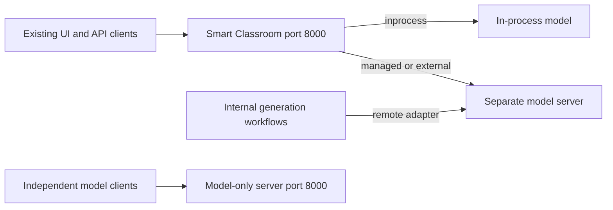

# edu-ai-suite VLM/LLM Upgrade: Stakeholder Review

**Implementation baseline:** Commit `eee320f33b2decd9c1bc7cdcacd20c40eb15c940` (`eee320f3`), "Support VLM/LLM model serving and model upgrade to qwen3.6/3.8".

**Review date:** 2026-10-09. **Audience:** Product, engineering, platform operations, security and quality assurance. **Status:** Implementation review; not a declaration of general-release readiness.

## Executive Summary

This upgrade makes the suite's text and vision-language inference more reusable. It expands Qwen3.6/Qwen3.8 model deployment support, adds independently runnable model serving, introduces tool-call interactions for agent integrations, and provides optional dFlash speculative decoding. Existing classroom workflows and their port-8000 API entry point remain in place.

The practical benefits are greater model choice, the ability to run inference without loading unrelated classroom services, process isolation for model failures, and workload-dependent inference acceleration. The commit supplies a foundation for future agent applications and model upgrades; it does not include a tool-execution platform, automatic multi-model routing, or high availability.

**Recommendation:** Approve a controlled evaluation of the new serving modes and models. Retain the existing installed default until application, hardware and operational acceptance criteria pass. Treat dFlash as an opt-in optimization for qualified workloads, not a blanket performance improvement.

## Key Capability Changes

| Area | Capability introduced or expanded | Stakeholder impact |
| --- | --- | --- |
| Model choice | Qwen3.6-35B-A3B deployment refinements and Qwen3.8-27B artifact mappings, with INT4/INT8 selection and newer OpenVINO runtime pins | Teams can evaluate larger models against workload quality, latency and memory requirements. Support paths are available; full platform qualification is still required. |
| Deployment flexibility | New `managed` and `external` modes plus a standalone model-server entry point | Inference can run separately from classroom workflows, or be shared through an independently operated endpoint. |
| Agent integration | Full text conversation history, function/tool calls, tool results, reasoning output and a model-list endpoint | Applications can implement model-to-tool-to-model interactions using an OpenAI-compatible HTTP contract. The application remains responsible for executing tools safely. |
| Inference performance | Optional dFlash target/drafter integration | Reported PTL results show gains for code and JSON generation, with little improvement for prose summaries. |
| Operational resilience | Warm-up readiness, bounded admission, stall detection and supervised restart in managed mode | Model failures are more observable and recoverable, with stronger process separation than in-process serving. This is not uninterrupted availability. |
| Future upgrades | Shared protocol, centralized family/template handling, custom IR paths and hybrid-attention token-budget improvements | New model onboarding requires fewer workflow-specific changes, while architecture compatibility must still be tested. |

### What Remains Compatible

- The commit retains `Qwen/Qwen3-VL-8B-Instruct`, INT4, GPU and `serving.mode: inprocess` as defaults, with dFlash off and API thinking disabled unless requested. Individual deployments may select a different model.
- React, Flutter, Content Search and existing classroom API addresses do not require migration. Summary, mind map, segmentation, reports and other text-generation consumers retain the shared handler interface.
- The desktop configuration change adds Qwen3.8-27B to existing model suggestions; it does not redesign the UI.
- Configuration remains under `models.text_gen`. The main application remains on port 8000; no new gateway or application-port relocation is introduced.

## Model and Platform Coverage

The upgrade targets Intel Arrow Lake (ARL) and Panther Lake (PTL), using OpenVINO for text and image inference. The committed user guide reports PTL INT4 results; it explicitly states that Arrow Lake and INT8 variants have not been measured. Implementation support must therefore be distinguished from validated deployment support.

| Model | Precision | Artifact acquisition path | Reported qualification status |
| --- | --- | --- | --- |
| Qwen3-VL-8B-Instruct | INT4 default | Existing preconverted IR path | PTL guide reports chat, images, tools and streaming; retain as the migration baseline. |
| Qwen3.6-35B-A3B | INT4 | Preconverted OpenVINO IR, with local export fallback | PTL guide reports images, tools, thinking and dFlash; about 45 tokens/s without dFlash. ARL remains unmeasured. |
| Qwen3.6-35B-A3B | INT8 | Local export; no preconverted mapping in this commit | Both platform combinations require measurement and qualification. |
| Qwen3.8-27B | INT4 | Preconverted OpenVINO IR, with local export fallback | PTL guide reports images, tools and thinking; about 7.6 tokens/s. ARL remains unmeasured; dFlash is unqualified. |
| Qwen3.8-27B | INT8 | Preconverted OpenVINO IR, with local export fallback | Both platform combinations require measurement and qualification; dFlash is unqualified. |

The two upgrade target models, two precisions and two platforms form **eight qualification combinations**. Release evidence should identify exact artifacts, processor/GPU, OS, driver, context limits, concurrency, memory consumption and task quality for each. Throughput figures alone do not establish comparative answer quality. CPU execution requires separate qualification; NPU support is not included in this upgrade.

**Runtime and capacity:** The commit pins `openvino==2026.4.1`, `openvino-genai==2026.4.1.0` and `openvino-tokenizers==2026.4.1.0`. The guide identifies OpenVINO 2026.4+ as necessary for Qwen3.8. Runtime guards check recognized model-card requirements before loading and reject detected dFlash drafters on GenAI older than 2026.4.

The guide recommends 64 GB system RAM for the larger models and reports INT4 IR sizes of approximately 19.6 GB for Qwen3.6 and 15.9 GB for Qwen3.8. INT8 increases weight memory substantially. These sizes exclude runtime overhead, caches and drafter allocations; shared system/iGPU memory must be budgeted together. Qwen3.6's approximately 3B active MoE parameters do not imply that only 3B parameters must reside in memory.

## Deployment Architecture

| Deployment | Ownership and behavior | Intended use |
| --- | --- | --- |
| `inprocess` | The main application loads the model. Application and inference share a process and failure domain. | Preserve the existing desktop default. |
| `managed` | The application starts and supervises a model-server child, normally on port 8010. The app remains on port 8000. | Isolate model-process failures while keeping familiar application startup. |
| `external` | The application connects to an existing model endpoint and never starts or stops it. | Share an independently operated server across applications or workflows. |
| Model only | Run `python -m model_serving --port 8000` from the Smart Classroom root, with the main app stopped on that address. | Use inference without starting classroom, retrieval or UI services. |

The two model-only and application deployments are alternatives when using the same local port 8000. In remote modes, the application forwards `/v1/chat/completions` and `/v1/models`; it does not become a general-purpose reverse proxy. Other classroom routes remain unchanged.

**Decoupling boundary:** The standalone server does not start ASR, OCR, video analytics or ChromaDB. However, it still uses Smart Classroom's package location, shared utilities, configuration and dependency environment. This commit delivers process-level separation, not a fully independent distribution of every suite module. Content Search still needs its storage, embedding and optional OCR dependencies. A managed child follows its parent application's lifecycle; use external ownership for a durable shared service.

## Tool Calls and Agent Extensions

The shared chat API replaces the previous last-user-message-only route with conversation and tool-aware processing. It accepts system/developer, user, assistant and tool turns, user image inputs, function definitions, tool-selection options and tool-result messages. JSON and XML-style Qwen tool output are normalized into OpenAI-compatible `tool_calls`.

Text and reasoning can stream; completed tool calls are buffered before publication. Clients can request separate `reasoning_content`, token usage and JSON-oriented `response_format` output. `/v1/models` lists the single configured model. One model is active per server instance; a request's `model` field does not provide multi-model routing.

The agent interaction is: **request -> proposed tool call -> authorized execution by the client/controller -> tool result -> model response**. The server never executes tools. Permissions, user approvals, idempotency, execution isolation, conversation checkpoints and loop/time/token budgets belong in the external controller. Future agent protocols and integrations can build on this contract without requiring new classroom UI controls.

**Important contract limits:** Tool validation checks offered names, argument objects and required keys, not the full JSON Schema. Malformed generated calls return as text; forcing a call does not guarantee a valid completed call. If runtime grammar configuration fails, structured-output generation may continue unconstrained. These behaviors require explicit acceptance or stricter handling before consequential agent actions or schema-dependent integrations are enabled.

## dFlash Performance

dFlash uses a small parallel drafter conditioned on target-model hidden states; the target verifies the proposed tokens. This can reduce decode time, but benefit varies by workload. Compatible target and draft IR, hidden-state metadata and the supported GenAI runtime are required; missing drafter artifacts must be prepared separately.

### Reported Measurements

The committed user guide reports the following API-path results for Qwen3.6-35B-A3B INT4 on Core Ultra X7 358H / Arc B390, 64 GB RAM, driver 32.0.101.8826 and OpenVINO 2026.4.1, with five draft tokens per step:

| Workload | Plain decoding | dFlash | Reported speedup |
| --- | --- | --- | --- |
| Code generation | 45.1 tokens/s | 99.3 tokens/s | 2.2x |
| JSON lesson report | 45.1 tokens/s | 63.7 tokens/s | 1.4x |
| Prose summary | 37.8 tokens/s | 38.8 tokens/s | About 1.0x |

Each figure is the **best of two runs of about 170 output tokens**. These are exploratory measurements reported in the commit, not a latency guarantee or a statistically established quality comparison. The guide notes output differences from plain greedy decoding. ARL, INT8 and Qwen3.8 dFlash performance is not established by these results.

### Enablement Policy

| Mode | Current behavior |
| --- | --- |
| `off` | Default; run the target without a drafter. |
| `auto` | Attempt speculative pipeline construction at startup and use plain decoding if construction fails. This is compatibility fallback, not adaptive workload selection. |
| `on` | Require successful speculative pipeline construction; otherwise fail startup. This is not a per-request guarantee of speculative decoding. |

An active speculative pipeline forces greedy decoding, so sampling requests do not retain their temperature/top-p semantics. Image requests decode without speculation even in `on` mode, and prefix caching is disabled. There is no general runtime or warm-up-failure fallback after construction, nor a safe automatic switch midway through a streamed answer.

**Review position:** Keep dFlash opt-in. Qualify code, JSON, summaries, RAG answers, tool turns and image scenarios separately, measuring task quality, time to first token, end-to-end p95 latency and peak memory. Do not extrapolate decode speedups to retrieval, image encoding or overall workflow completion time.

## Reliability and Release Readiness

The standalone service reuses bounded model admission (default: one active request and eight queued). The upgrade adds one-token warm-up, standalone `/live` and `/ready`, and model details in `/health`. Managed serving adds crash recovery with backoff/jitter, a default restart budget of five per ten minutes, and parent-process tracking. The standalone stall watchdog uses a default 300-second no-progress threshold; load/configuration failures are not endlessly restarted. Remote workflow retries stop once response streaming begins.

These improve recovery and visibility, but **do not guarantee high availability**. The main app's port-8000 entry point still depends on that app/host. External servers need their own operational supervisor, and `/health` HTTP success alone does not prove model readiness; consumers must inspect model state or `/ready`.

| Release concern | Gap requiring acceptance or follow-up | Review responsibility |
| --- | --- | --- |
| Hardware and application quality | Complete the eight model/precision/platform combinations; validate real classroom tasks, image flows, context limits and memory headroom. | QA, platform engineering and product |
| Native failure recovery | Initial-load deadlines, per-request stall detection and safe isolation after failed cancellation are incomplete. A timed native-thread join can finish without the device becoming idle. | Serving engineering and operations |
| Agent correctness | Strict schema validation, required call/result identity, failed forced-call handling and schema-output failure policy need hardening. Tools remain externally authorized. | Application engineering and security |
| Remote access | Worker bearer authentication is optional and does not authenticate callers at the main-app proxy. Health access, local image paths, payload limits and TLS require deployment controls. | Security and operations |
| Availability and safe upgrades | No replica failover, model registry, staged promotion or automated rollback is provided. Shared ingress and model identity checks need separate design. | Architecture and operations |

Broad unattended deployment should be gated on the relevant gaps above. Recovery objectives must be measured on the intended hardware; neither restart logic nor the current timeout values establish an uptime SLA.

## Decisions Requested

1. **Pilot scope:** Approve controlled PTL INT4 evaluation of Qwen3.6 and Qwen3.8, without changing the installed default or claiming ARL/INT8 certification.
2. **Deployment ownership:** Use managed mode for app-owned process isolation and external mode for independently operated shared serving. Confirm operational ownership before enabling shared access.
3. **Agent and optimization policy:** Keep tool execution in an authorized controller and dFlash opt-in. Agree on strict schema behavior and unsupported sampling/image handling before enabling affected integrations.
4. **Release criteria:** Assign owners for application regression results, the full hardware matrix, security review and fault-recovery testing. Define quality, latency, memory and recovery thresholds per supported workload.
5. **Follow-on investment:** Decide whether independent packaging and multi-host availability are required for the next release; neither is implied by this commit.

## Forward Roadmap

The shared protocol and model adapter reduce coupling to individual workflows. Centralized family/template handling and custom IR directories simplify upgrades, but recognizing a future Qwen version by name is not proof of runtime compatibility.

The next architectural steps are immutable model revisions and export manifests, capability discovery, independent packaging/configuration, and resource-aware routing across separately budgeted workers. Multi-model selection, fair workload admission, staged upgrades and rollback remain future capabilities. Agent state and tool execution should stay outside inference workers so their lifecycle does not depend on a particular model process.

## Evidence and References

The commit adds model-free protocol, parser, serving-mode and supervisor tests, extends model-family/path coverage, and adds live model-list/tool-round-trip checks. Their presence is not a test-pass report. Stakeholder release approval should include recorded automated-test results and reproducible hardware/quality evidence; this review does not independently certify the reported measurements.

| Source | Review purpose |
| --- | --- |
| [model-serving.md](../../user-guide/model-serving.md#L1) and [config.yaml](../../../config.yaml#L76) | Usage, current defaults, supported options and reported benchmark conditions. |
| [api/vlm_chat.py](../../../api/vlm_chat.py#L1), [server.py](../../../model_serving/server.py#L1) and [client.py](../../../model_serving/client.py#L1) | Port-8000 compatibility, standalone lifecycle and remote ownership. |
| [openai_chat.py](../../../model_serving/openai_chat.py#L1) and [tool_parser.py](../../../model_serving/tool_parser.py#L1) | Implemented chat/tool behavior and validation limits. |
| [text_gen_vlm.py](../../../components/vlm/text_gen_vlm.py#L1) and [requirements.txt](../../../requirements.txt#L1) | Runtime loading, speculative decoding, cancellation and dependency pins. |
| [test_openai_chat.py](../../../model_serving/test/test_openai_chat.py#L1), [test_serving_modes.py](../../../model_serving/test/test_serving_modes.py#L1) and [test_vlm_chat_parity.py](../../../model_manager/test/test_vlm_chat_parity.py#L1) | Automated and live-integration test scope. |

The supplied [dFlash article](https://huggingface.co/blog/ofirzaf/intel-dflash-ptl) provides additional research context for PTL and Qwen3.6. It discusses Qwen3.6-27B, not Qwen3.8-27B; it is not evidence of 3.8 or ARL qualification. Its local MHTML snapshot was supplied separately and is not part of the baseline commit.