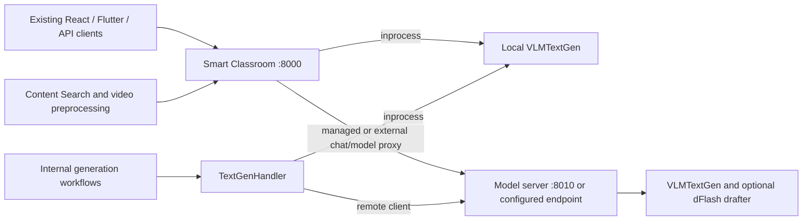

# edu-ai-suite VLM/LLM model upgrade design

Status: Partially implemented in the current working-tree changes. Updated: 2026-10-09. This document distinguishes code present in the staged/unstaged diff and new files from remaining design requirements. Code presence and benchmark claims in the accompanying guide are not equivalent to release certification. This update changes only the design document, not runtime code or configuration.

## Goals and current baseline

- Add OpenVINO model profiles for Qwen3.6-35B-A3B and the requested Qwen3.8-27B, each with INT8 and INT4 weight variants, on Intel Arrow Lake (ARL) and Panther Lake (PTL). Validate each combination before declaring it supported.
- Keep existing UI URLs and request flows while allowing model serving, content search, and other Smart Classroom workflows to start and fail independently.
- Expose chat, multimodal inference where supported, and structured tool calls through the existing `:8000/v1/chat/completions` entry point. Leave room for agent orchestration without making tool execution part of the model server.
- Offer opt-in dFlash speculative decoding when the model, draft model, precision, runtime, and hardware have been verified together.

The current [smart-classroom/config.yaml](smart-classroom/config.yaml#L76) still selects `models.text_gen.vlm_name: Qwen/Qwen3-VL-8B-Instruct`, `device: GPU`, and `weight_format: int4`, with concurrency 1, queue depth 8, and `max_new_tokens: 5120`. It now also sets `enable_thinking: false`, `serving.mode: inprocess`, and `speculative.mode: "off"`. New model options do not change the installed default.

[smart-classroom/api/vlm_chat.py](smart-classroom/api/vlm_chat.py) now dispatches through the shared [smart-classroom/model_serving/openai_chat.py](smart-classroom/model_serving/openai_chat.py) protocol layer in process, or proxies the request to a remote model server. The former last-user-message-only route has been replaced. [smart-classroom/components/vlm/text_gen_handle.py](smart-classroom/components/vlm/text_gen_handle.py) selects either `VLMTextGen` or a remote adapter, so existing internal generation callers retain their handler interface. The new [smart-classroom/model_serving/server.py](smart-classroom/model_serving/server.py) reuses that handler with `mode="inprocess"` to avoid recursively connecting to itself. The older VLM serving application remains legacy code; the new standalone entry point is `python -m model_serving`.

## Implemented service boundary

The diff implements process separation without a new gateway process or relocating the main application. [smart-classroom/main.py](smart-classroom/main.py) remains the owner of port 8000 whenever the classroom app runs. Only `POST /v1/chat/completions` and `GET /v1/models` are forwarded in remote modes; this is not a generic `/v1/*` reverse proxy.



| Mode | Model owner | Port and lifecycle contract |
| --- | --- | --- |
| `inprocess` (default) | Main application | Existing app and model share port 8000 and the same failure domain. |
| `managed` | App-managed standalone child | App stays on 8000; model server defaults to 8010. The app owns child startup/recovery; this is process isolation, not independence from the app's lifecycle. |
| `external` | Independently launched server | App connects to `serving.endpoint` or host/port and does not own the server. Internal workflows and the app's two model routes use this endpoint. |
| Model-only launch | Standalone server | Run `python -m model_serving --port 8000` from the Smart Classroom root with the classroom app stopped. No separate gateway is required. |

There must be one listener per address/port. An external server must use a different port or host when the classroom app already binds local port 8000. The proxy streams upstream bytes and forwards `content-type`, `retry-after`, and `cache-control`; arbitrary headers, all model-service health endpoints, and unrelated routes are not automatically forwarded. Existing classroom UI, asset, websocket and non-model routes stay in place. [utils/flutter/start.ps1](utils/flutter/start.ps1) still launches the main application; a new suite orchestrator is not part of this diff.

### Independence delivered and remaining

The standalone server loads only text generation and does not start classroom feature bootstrap, ASR, OCR, video analytics or ChromaDB. It still lives under Smart Classroom, imports shared capability/config/model utilities, and uses the same configuration and dependency environment. Process independence is implemented; a separately packaged suite-level service, independent configuration schema, offline-only artifact preparation, and independently locked dependencies remain future work. Current model loading may download/export missing artifacts at first use.

| Deployment selection | Processes started | Dependency behavior |
| --- | --- | --- |
| Model only | Standalone model server | Implemented entry point; independent model health and model APIs without a classroom UI. |
| Content Search with external model | Existing retrieval/ingestion services plus a separately launched model server | Model HTTP integration can use the standalone endpoint; optional OCR and service orchestration are separate dependencies, not removed by this extraction. |
| Selected classroom modules | Existing classroom launcher and selected capabilities | Remote generation uses the new adapter; unrelated capabilities keep existing ownership. |
| Full suite | Existing launcher plus optional managed child, or an external model server | No second local inference model is needed in the app when remote mode is selected. |

Content Search still declares text-generation and optional OCR dependencies in [smart-classroom/model_manager/features/content_search_feature.py](smart-classroom/model_manager/features/content_search_feature.py). The remote handler's state follows server readiness, preserving the existing dependency contract instead of removing it. A fully independent ingestion deployment must still provide OCR when enabled; extracting OCR is not implemented here. Embedding and reranking models remain owned by Content Search.

For shared deployments, use `external` ownership; a managed child is not a durable shared service. Keep client configuration and actual remote model identity consistent. Authentication, health probing, process adoption, timeouts and cancellation must be tested on the remote path, not inferred from local behavior. An independent gateway/load balancer is an optional later availability/scaling layer, not a prerequisite or an implemented port-8000 component.

## Model support and configuration

### Implemented model acquisition

There is currently one configured model per service, selected by `models.text_gen.vlm_name` and `weight_format`; no versioned profile catalog or multi-model routing is implemented. [smart-classroom/components/vlm/vlm_openvino_serving/utils/utils.py](smart-classroom/components/vlm/vlm_openvino_serving/utils/utils.py) maps model/precision pairs to preconverted repositories and falls back to local export when download fails or no mapping exists. Existing absolute IR directories are accepted by [smart-classroom/utils/model_paths.py](smart-classroom/utils/model_paths.py). Otherwise the cache remains `models/openvino/<model-name>/<weight-format>/`, without revision/export-digest namespacing.

| Model | Weight precision | Acquisition path in code | PTL evidence reported in the new guide | Remaining platform qualification |
| --- | --- | --- | --- | --- |
| Qwen3.6-35B-A3B | INT4 | `OpenVINO/Qwen3.6-35B-A3B-int4-ov`, with local export fallback | Arc B390: chat, images, tools, thinking and dFlash; about 45 tokens/s plain decoding | Arrow Lake and reproducible release-grade PTL tests pending. |
| Qwen3.6-35B-A3B | INT8 | Local export; no preconverted mapping | Not measured | Both platforms, export completion, memory fit and quality pending. |
| Qwen3.8-27B | INT4 | `OpenVINO/Qwen3.8-27B-int4-ov`, with local export fallback | Arc B390: chat, images, tools, thinking; about 7.6 tokens/s | Arrow Lake and reproducible release-grade PTL tests pending; dFlash unqualified. |
| Qwen3.8-27B | INT8 | `OpenVINO/Qwen3.8-27B-int8-ov`, with local export fallback | Not measured | Both platforms, memory fit and quality pending; dFlash unqualified. |
| Qwen3-VL-8B-Instruct | Existing INT4 default | Existing preconverted acquisition | Arc B390: chat, images, tools and streaming | Preserve baseline regressions and qualify each intended deployment. |

Evidence source: [smart-classroom/docs/user-guide/model-serving.md](smart-classroom/docs/user-guide/model-serving.md). These are measurements reported by the implementation author, not new hardware tests performed for this document update. The guide identifies Qwen3.6-35B-A3B as a MoE VLM and Qwen3.8-27B as a dense VLM. The code uses `VLMPipeline` for the current target path; it does not select `LLMPipeline` from capability metadata. The original article discusses Qwen3.6-27B, not Qwen3.8-27B, so evidence for 3.8 must come from the current artifacts and tests rather than that article. Do not silently substitute a different model or precision.

The four requested model/precision variants across two platforms still form **eight required qualification combinations**, not eight completed certifications. Initial performance qualification targets the integrated GPU; CPU is a separately tested deployment profile, not an automatic fallback or GPU-level performance promise. NPU execution remains outside scope. Record exact processor SKU, RAM, usable shared-GPU allocation, OS, driver, power mode, runtime, model revisions and workload for every result.

[smart-classroom/requirements.txt](smart-classroom/requirements.txt) now pins `openvino==2026.4.1`, `openvino-genai==2026.4.1.0`, and `openvino-tokenizers==2026.4.1.0`; the export stack includes `optimum==2.3.0`, `optimum-intel==2.1.0`, and `nncf==3.3.0`. The guide lists minimum OpenVINO versions of 2026.3 for the baseline, 2026.2 for Qwen3.6, and 2026.4 for Qwen3.8. In code, `runtime_incompatibility()` reads a model card's minimum-version sentence before loading; a missing/unrecognized card does not enforce a minimum. This guard is not a complete signed compatibility manifest. A separately detected dFlash drafter requires GenAI >= 2026.4.0.

### Precision and memory admission

INT4 and INT8 describe weight compression, not an assertion that every operator, activation, or KV-cache tensor uses that bit width. Record the actual export recipe (for example, W4A16), group size, mixed-precision exclusions, calibration data version, and compression ratio in each manifest. Evaluate quality separately for both variants; do not silently substitute INT4 for an explicitly selected INT8 profile.

For planning only, 35 billion uniformly packed parameters require about 17.5 GB at 4 bits or 35 GB at 8 bits; 27 billion require about 13.5 GB or 27 GB respectively (decimal GB). These are nominal weight-only estimates, not minimum system-RAM recommendations or measured artifact sizes. MoE's approximately 3B active parameters do not mean only 3B weights must reside in memory. Include quantization metadata, uncompressed tensors, vision components if present, compiled graphs, workspace, KV cache at the admitted context/concurrency, the drafter, and OS/other-module reserves. Do not double-count shared system/iGPU RAM as independent pools.

The guide reports INT4 IR sizes of approximately 19.6 GB for Qwen3.6 and 15.9 GB for Qwen3.8 and recommends 64 GB system RAM for these larger models. Treat these as reported observations, not a guarantee that every context/concurrency combination fits. Remaining design requirement: admit a load/request only when measured peak plus headroom fits host/device budgets, and publish validated context, image/frame and concurrency limits per SKU/precision. The current bounded request queue and OOM handling do not constitute predictive memory admission. CPU/smaller-model fallback is not implemented and would require explicit policy.

[smart-classroom/utils/text_chunker.py](smart-classroom/utils/text_chunker.py) now counts only full-attention layers when estimating KV geometry for hybrid models. This avoids treating every linear-attention layer as a growing KV cache, but does not account for every recurrent state, dFlash allocation or competing feature. Retain measured peak-memory admission as a separate gate.

### Current configuration contract

The following uses the implemented keys and existing defaults, not the former proposed top-level `model_service.profiles` schema:

```yaml
models:
  text_gen:
    provider: vlm
    vlm_name: Qwen/Qwen3-VL-8B-Instruct
    device: GPU
    weight_format: int4
    max_new_tokens: 5120
    concurrency: 1
    queue_max: 8
    enable_thinking: false
    serving:
      mode: inprocess
      host: 127.0.0.1
      port: 8010
      stall_timeout_s: 300
      max_restarts: 5
    speculative:
      mode: "off"
      draft_model: z-lab/Qwen3.6-35B-A3B-DFlash
      num_assistant_tokens: 5
```

For a candidate model, change `vlm_name` to `Qwen/Qwen3.6-35B-A3B` or `Qwen/Qwen3.8-27B` and select `weight_format: int4` or `int8`; there is no separate profile-enable flag today. Keep the default unchanged until qualification. The draft name in the example is dormant when speculation is off and is not a compatible drafter for every possible target.

[smart-classroom/model_serving/settings.py](smart-classroom/model_serving/settings.py) also supports `serving.endpoint` (overrides derived host/port), `serving.ready_wait_s` (default 900 for remote-client retry waiting), and `serving.api_key`. `MODEL_SERVING_API_KEY` overrides the configured key. Use `endpoint` overrides for external servers; managed spawning uses `host`/`port`, so a conflicting endpoint is not a supported topology. Speculation additionally accepts optional draft `weight_format` and `device`, otherwise inherited from the target. Modes are normalized, including YAML boolean spellings for speculative off/on, but quote enum values in configuration.

Managed children inherit `SC_CONFIG_PATH`; standalone `--config` selects that same configuration loader before model imports. The remote adapter uses local tokenizer files for budgeting when available and raises if they are absent; callers need their existing fallback. There is no remote token-budget or resolved-model capability API yet. Health metadata for a remote handler reports configured model/device and `speculative: remote`, not a verified copy of the server's loaded profile. Preserve Content Search's existing port-8000 address in app deployments; model-only deployments can use the standalone server at the same address.

[smart-classroom/model_serving/__main__.py](smart-classroom/model_serving/__main__.py) provides `--host`, `--port` and `--config`; it resolves configuration before importing the server and runs from the Smart Classroom root. [smart-classroom/ui/electron/services/config-schema.cjs](smart-classroom/ui/electron/services/config-schema.cjs) only adds Qwen3.8-27B to the existing model suggestions. No UI layout or endpoint migration is required, and this schema edit does not introduce a model registry or serving-mode controls.

Future artifact management should add immutable source revisions, hashes, license/export manifests, atomic preparation/promotion, revision-aware cache keys and runtime/device/driver-aware compiled caches. Move conversion out of request-time lazy loading into explicit provisioning. Those mechanisms and a versioned profile catalog remain proposals; do not describe them as implemented safeguards.

### Forward compatibility and scaling

Implemented foundations are a shared protocol layer, `TextGenHandler` plus `RemoteTextGen`, and centralized family/template/export handling. [smart-classroom/utils/model_family.py](smart-classroom/utils/model_family.py) uses parsed versions to treat Qwen >= 3.5 as template-controlled thinking/export-overlay candidates while retaining the old helper alias. This is a prompting heuristic, not proof that every future Qwen architecture, tokenizer or IR will work. Test model metadata and templates before claiming support for a new release.

Next, separate the stable chat API, a versioned profile schema, and runtime adapters with explicit load/generate/cancel/health/unload contracts. Add `LLMPipeline` only where needed and verified for a text-only architecture; preserve current VLM support and no UI-family branches. Keep `/v1/models` in its standard list envelope and add a versioned capability endpoint only when its fields are implemented. Unknown profile versions and unsupported model aliases must eventually fail validation rather than selecting the configured model implicitly.

Multi-model routing, quotas, fair interactive/background admission, independent replicas and rolling upgrades remain future work. Route only among ready workers with the same immutable model/precision revision; add independently budgeted devices/hosts rather than duplicating a large model per HTTP process. An optional gateway/load balancer can provide that routing without moving existing classroom routes. Measure the existing remote-handler queue and retry behavior before claiming a single end-to-end queue. Any future session/prefix cache must be revision-bound and tenant-isolated; agent state stays outside workers.

## Chat and tool-call contract

### Implemented shared protocol

Both integrated and standalone routes use [smart-classroom/model_serving/openai_chat.py](smart-classroom/model_serving/openai_chat.py). [smart-classroom/model_serving/tool_parser.py](smart-classroom/model_serving/tool_parser.py) separates reasoning, text and buffered calls, accepting Hermes JSON and qwen3coder XML tool dialects. The current subset is materially broader than the old last-user-only route, but not full OpenAI parity.

| Contract area | Behavior implemented in the diff |
| --- | --- |
| History | Accept `system`, `developer`, `user`, `assistant`, and `tool`; map `developer` to `system` for templating. Require at least one user turn. Flatten content parts into text and collect user images; do not claim lossless image-position preservation across turns. |
| Tool definitions | Accept function names and JSON-object parameter schemas. Parse JSON/XML calls, check offered names, object-shaped arguments and required-key presence; XML parameter values use schema-informed coercion. This is not full JSON Schema validation. |
| Selection policy | `auto` leaves selection to the model; `none` removes tool definitions; `required` or a named function appends a tool-call prefill and disables thinking. With `parallel_tool_calls: false`, only the first parsed call is returned; it is not a generation-level constraint. |
| Assistant call | Valid calls return generated IDs, function names and JSON-string arguments with `finish_reason: tool_calls`; a tool-only response may have `content: null`. Malformed/unoffered/missing-required-argument calls are returned as plain text, not a tool-call error response. |
| Tool result | Require a preceding assistant tool-call turn. Check unknown/duplicate result IDs when IDs are supplied; IDs are optional and not a strict end-to-end binding guarantee. |
| Streaming | Text and reasoning stream as available. Tool output is buffered until generation finishes and then emitted as complete indexed `delta.tool_calls`, followed by finish reason, optional usage and `[DONE]`. No partial draft/tool call is executed. |
| Generation fields | Accept `max_completion_tokens` or `max_tokens` (former takes precedence), temperature, top-p/top-k, penalties, seed, stop strings, `stream` and `stream_options.include_usage`. DFlash has the sampling exceptions documented below. |
| Thinking | Explicit `enable_thinking` overrides `chat_template_kwargs.enable_thinking`, which overrides the configured default. Other template kwargs pass through. Enabled reasoning is returned separately as `reasoning_content`; forced tool selection disables thinking. |
| Structured output | Accept `response_format: json_object` or `json_schema` and map to the runtime grammar configuration. Reject a schema combined with active tools. If runtime grammar setup fails, the engine logs and continues unconstrained; schema success is not guaranteed by the HTTP field alone. |
| Model and usage | `/v1/models` lists the single configured model; request `model` is not used for model selection or unknown-ID rejection. Usage is best-effort runtime metadata; finish reason is `tool_calls`, `length` or `stop`. Pydantic permits unknown extra request fields, so acceptance does not imply implementation. |

Input validation returns an OpenAI-shaped 400. Standalone overload/loading/OOM paths return 503 with `Retry-After`; the main app retains its existing exception handlers, so not every error body is identical across modes. Generic pre-stream failures are not uniformly mapped to the earlier proposed 502 contract. Once SSE headers are sent, the shared API emits a JSON `error` payload as SSE data and omits `[DONE]`; the remote text client also treats missing `[DONE]` as failure. The proxy's transport-interruption behavior needs its own end-to-end tests.

The remote internal adapter preserves the existing text-generation call interface, always streams on the wire and joins content for non-streaming callers. It is not a complete agent SDK: it consumes content/usage rather than forwarding tool/reasoning events. Agent clients should use the OpenAI-compatible HTTP API directly.

### Remaining agent and security requirements

The server **never runs tools**. The client/controller must authorize and execute each complete call, append the assistant call and corresponding tool result, then send the next completion. Add strict schema validation, mandatory call/result identity, explicit failure semantics for unsatisfied `required`/named selection, and a deliberate policy for malformed calls before treating this as a robust agent boundary. Prefilling a tool-call prefix does not guarantee a valid completed call after truncation or malformed output. Strict structured-output workflows must fail closed when grammar support is unavailable rather than relying on the current unconstrained fallback.

Keep tool execution, permission checks, idempotency, approvals, conversation checkpoints and loop/token/time/result-size budgets in a separate agent controller. Future MCP connectors and durable agent workflows can use this HTTP contract without changing current UIs. Revision pinning and capability discovery for agent loops remain future work because the current server has no immutable profile registry.

Standalone `/v1/*` authentication is optional bearer-key validation. The app proxy inserts the configured upstream key but does not itself validate a caller key; securing the worker alone does not secure the app-facing port 8000. Require ingress authentication/TLS and explicit allowed origins before remote exposure. `/live`, `/ready` and `/health` are not protected by the worker's `/v1/*` middleware and need network-level access policy.

The image decoder refuses HTTP(S) fetches and accepts data URLs or local paths. A 32 MB encoded-payload check applies to data URLs, not a comprehensive local-file/pixel/count budget. Add local-path allowlisting or disable local paths for untrusted clients, decoded-size/frame limits, tenant quotas and redacted audit logs. Retrieved documents, image contents and tool results are data, not authority to expand tool permissions.

## Reliability and availability

### Implemented mechanisms

[smart-classroom/model_serving/server.py](smart-classroom/model_serving/server.py) loads on a background thread and reuses `CapabilityRunner` admission. [smart-classroom/model_serving/client.py](smart-classroom/model_serving/client.py) owns managed supervision, remote readiness and workflow-client retries.

| Mechanism | Current behavior |
| --- | --- |
| Admission | Target handler retains configured concurrency/queue limits (1/8 by default), with 503 backpressure. Remote handlers still use a local runner with adjusted concurrency; there is not yet a proven single queue across all client and server stages. |
| Warm-up | A one-token generation runs after pipeline/tokenizer load. Standalone phase is `loading`, then `ready`; a load/warm-up exception sets failure and exits with code 3. |
| Stall handling | Global API activity tracks generated-token progress. The standalone watchdog checks every 5 seconds and exits with code 4 after `stall_timeout_s` without progress during active API work. This is not a per-request or model-load deadline. |
| Managed recovery | Restart after failures with exponential backoff, a 60-second base cap and +/-20% jitter, limited to `max_restarts` (5) per 600 seconds. Exit code 3 is not retried. Six failed liveness polls after a first success trigger recycle; probe time adds to the nominal polling interval. |
| Ownership | A managed child receives a parent PID and exits if the parent disappears. An already responsive `/live` endpoint is adopted without ownership; the app does not stop that existing process. External mode never starts/stops the server. Adoption currently checks liveness, not model identity/version. |
| Remote workflow retries | `RemoteTextGen` retries connection/request failures and 502/503/504 before receiving an accepted response, bounded by `ready_wait_s` (900 by default), honoring `Retry-After`. It never replays a stream once consumption starts. This is not exactly-once execution; a lost response can still imply duplicated inference work. |
| Public proxy | The two main-app model routes use HTTPX with connect/write/read timeouts and stream upstream responses. They do not implement the remote workflow adapter's retry loop or a circuit breaker. |
| Cancellation | API iterators signal a cancel event; the streamer returns OpenVINO cancellation and joins the native worker for up to 30 seconds. If the worker is still alive, the code logs and can release the runner slot anyway. Device-idle safety after a hung cancellation is not guaranteed. |

### Health and operational gaps

| Endpoint | Current standalone meaning |
| --- | --- |
| `/live` | Responsive process, or 503 once global generation inactivity exceeds the stall threshold. |
| `/ready` | 200 only after background load and one-token warm-up; otherwise 503 with the current phase/model. It is not a generation canary on every probe. |
| `/health` | Always an HTTP success payload with `status: ok` and `hub.text_gen` details. Consumers must inspect the nested state/loaded fields; HTTP 200 alone is not model readiness. |
| `/v1/models` | Single configured model listing, not proof it has finished loading. |

The main app's existing `/health` gains handler details (serving mode, model, precision, speculative status and remote error/endpoint where available). Remote state checks `/ready` with a two-second cache. No `/model-service/live`, `/model-service/ready` or versioned capability endpoint is implemented. Content Search retains its existing all-required-services `/api/v1/system/health` and liveness `/api/v1/system/ping` contracts; the standalone compatibility payload supplies the nested text-generation state it expects.

Remaining reliability requirements: a bounded initial-load/warm-up deadline (the current supervisor can wait indefinitely before first liveness or during a live but hung load), per-request queue/prefill/idle/total deadlines, circuit breaking, model-aware adoption, and hard isolation before returning a slot when native cancellation fails. Global activity can be refreshed by other requests and is not a concurrency-safe per-request stall detector. Stream queues/buffers also need bounded-memory/backpressure tests. Validate cleanup under real GPU hangs; successful cooperative cancellation is not sufficient evidence.

Keep standalone external services under an operator-managed OS/container supervisor; the app does not restart them. Managed/inprocess modes have different failure domains, and only managed/standalone operation gets the new standalone watchdog. Add structured metrics, alerting, request correlation, predictive memory checks, artifact integrity, graceful drain and rollback before claiming production availability.

### Availability tiers and upgrade safety

| Tier | Reliability mechanism | Explicit limitation |
| --- | --- | --- |
| Current single AI PC | Bounded target admission, managed supervisor, standalone watchdog and warm-up readiness | No implemented HA, circuit breaker or model rollback. A main-app/host outage removes its port-8000 facade; managed children also follow parent lifecycle. |
| Future hardened single host | Add safe cancellation isolation, startup deadlines, approved artifacts, circuit breaking and cold rollback | A device/host failure or reload still interrupts service. |
| Future replicated deployment | At least two workers with the same approved model revision and spare capacity, plus health-based routing and resilient ingress | Requires additional hardware and a resilient service address. Two processes on one GPU, or a single ingress process, retain a single point of failure. |

For local deployments, `127.0.0.1:8000` stays unchanged but cannot survive the local machine itself going offline. A future resilient remote hostname may preserve port 8000 without changing UI code, but requires deployment configuration. No design guarantees 100% availability. A proposed replicated-tier target is 99.9% successful valid inference requests during scheduled service hours within the published load envelope, counting overload/server failures. This is not an achieved SLO. Measure detection, restart and warm-up separately under fault injection; the current 300-second stall threshold and polling do not provide a universal 30-second recovery bound.

Future upgrade workflow: stage and verify immutable artifacts, warm/canary on spare capacity, atomically switch routing and drain the old worker. Retain a previous artifact/configuration for rollback on quality, latency or error regression. On a device that cannot hold both versions, schedule a cold switch with explicit downtime and a timed rollback. These controls are not implemented by changing `vlm_name` today. Already-streaming requests cannot transparently migrate; the client/controller decides whether to restart an interrupted turn without duplicating tool actions.

Required operational follow-up: export metrics for model revision, device, queue/rejections, startup, TTFT, p50/p95/p99 latency, throughput, memory, cancellation, tool parsing, OOM/restarts and dFlash acceptance. Add alerts and runbooks for readiness loss, restart-budget exhaustion, corrupt artifacts, stalled native work and rollback. Existing logs and token usage are useful foundations, not the complete monitoring contract. Redact prompts/results and bound retention by default.

## dFlash performance option

### Implemented pipeline and limits

[smart-classroom/components/vlm/text_gen_vlm.py](smart-classroom/components/vlm/text_gen_vlm.py) now creates the drafter with `ov_genai.draft_model()` and passes it to `VLMPipeline` together with `SchedulerConfig`. It uses `num_assistant_tokens: 5` by default, disables prefix caching, and sizes linear-attention scheduler blocks as configured live concurrency + 1 + draft-block length. The drafter must already exist as IR at the configured directory/cache path; the service does not automatically export a missing drafter. Detection uses `dflash_config` or `DFlashDraftModel` in its configuration and refuses a detected dFlash drafter on GenAI older than 2026.4.0.

dFlash conditions a parallel masked-token draft on target hidden states, unlike a generic autoregressive drafter. The target must have the matching hidden-state outputs; a missing-interface error is converted into an actionable re-export/re-download message. The guide reports compatible Qwen3.6 INT4 target IR from the 2026-09-25 upload onward. Current code does not enforce that revision, a target/drafter manifest match, or a per-workload qualification record; those remain release controls to add.

| Mode | Actual behavior in this diff |
| --- | --- |
| `off` (default) | Plain target pipeline; no drafter required. |
| `auto` | Try a speculative pipeline at model load. If drafter/pipeline construction fails, log the reason, set `speculative_status: unavailable: <reason>`, and construct a plain pipeline. This is compatibility fallback, not workload-adaptive selection. |
| `on` | Refuse model startup if speculative pipeline construction fails. This is a load-time requirement, not a guarantee of speculation for every request. |

While a speculative pipeline is active, `_apply_speculative()` forces `do_sample=False` and logs once when sampling was requested; temperature/top-p sampling semantics are therefore not preserved. Image requests do not receive assistant-token speculation and decode plainly on the same pipeline, including in `on` mode. Warm-up happens after pipeline construction; an `auto` warm-up failure is not retried with a plain pipeline. There is no implemented draft-runtime retry, adaptive kill switch, or state-preserving midstream switch to plain decoding. Do not replay partially streamed output on failure.

These behaviors differ from the earlier strict per-request proposal. Before general enablement, define whether unsupported sampling/image combinations should be rejected, explicitly acknowledged, or routed to a separate plain target pipeline. Tightening `on` into a per-request guarantee requires a code change and compatibility tests, not just revised documentation. Keep speculation off when the scenario requires sampling that the current dFlash path cannot preserve.

### Performance evidence and remaining gates

The supplied [Accelerating-Qwen3.6-on-Intel-PTL-with-DFlash.mhtml](Accelerating-Qwen3.6-on-Intel-PTL-with-DFlash.mhtml) reports Qwen3.6-35B-A3B target plus `z-lab/Qwen3.6-35B-A3B-DFlash`, both W4A16, on PTL: HumanEval 89.8 tokens/s (~2.2x), MT-Bench 54.7 (~1.3x), and GSM8K 68.5 (~1.6x) against a stated 41 tokens/s baseline. Its statement that support was upcoming describes the archived article, not the newly pinned runtime in this diff.

The accompanying model-serving guide separately reports API-path measurements on Core Ultra X7 358H / Arc B390, 64 GB RAM, driver 32.0.101.8826, OpenVINO 2026.4.1 and Qwen3.6 INT4:

| Workload | Plain tokens/s | dFlash tokens/s, 5 draft tokens | Reported speedup |
| --- | --- | --- | --- |
| Code | 45.1 | 99.3 | 2.2x |
| JSON lesson report | 45.1 | 63.7 | 1.4x |
| Prose summary | 37.8 | 38.8 | About 1.0x |

Each reported figure is the best of two runs of about 170 output tokens. These are exploratory throughput observations, not p95 latency, sustained availability or statistical quality evidence. The guide also reports slight output differences from plain greedy decoding; exact greedy parity and task-quality equivalence must be evaluated explicitly rather than asserted. No ARL, INT8 or Qwen3.8 dFlash results are established by these measurements.

For release, pin the target/draft/tokenizer/hidden-state/export/runtime/driver tuple. Test tools, grammar constraints, reasoning controls, streaming, cancellation and images separately. Only committed target output may reach tool parsing; no draft proposal may become an executable call. MoE block verification can activate more experts and increase traffic, so benchmark block lengths instead of assuming larger is faster.

Measure short Q&A, long RAG contexts, summaries, code, tool turns and image inputs under cold/warm and mixed-load conditions, reporting sample counts, TTFT, p50/p95/p99 end-to-end latency, acceptance, memory and quality. dFlash does not automatically accelerate retrieval, vision encoding or prefill. A future workload-adaptive `auto` policy should require repeatable benefit, for example at least 10% lower p95 end-to-end latency within preapproved memory/TTFT and quality limits, with a kill switch. The current `auto` implementation does not enforce that proposed gate.

## Rollout and verification

1. Preserve the current default (`Qwen3-VL-8B-Instruct`, INT4, inprocess, speculation off). Validate the implemented shared API and remote adapter in all three modes before changing installation defaults. Do not relocate the main app or introduce a mandatory gateway as part of this rollout.
2. Close correctness and isolation gaps: strict tool/result/schema handling, explicit unsupported-parameter policy, ingress protection, bounded initial load and safe native-cancellation recovery. Add failure tests for the exact proxy and remote-client paths rather than assuming shared protocol tests cover HTTP/process boundaries.
3. Qualify all eight requested model/precision/platform combinations with pinned artifact revisions and the current runtime stack. Reproduce reported PTL INT4 results, then cover ARL and INT8, images, long context, grammar/tool behavior, resource limits and sustained load. Publish unsupported/unmeasured combinations explicitly.
4. Package truly independent model deployment and optional workflow startup without breaking current UI endpoints. Keep external-service ownership separate from managed child ownership. Verify Content Search's optional OCR dependencies and remote tokenizer/model-identity handling before claiming complete suite-level decoupling.
5. Qualify dFlash by target/draft/precision/device/workload tuple. Resolve current sampling/image and warm-up-fallback semantics, collect repeatable latency/quality evidence, and add a disable path before considering adaptive `auto` or a broader default.
6. Add immutable profiles, capabilities, resource-aware routing and independent replicas only after single-model reliability is established. Implement staged promotion/draining/rollback according to available hardware; keep agent execution and durable state in separately authorized components.

### Existing test surfaces

| Changed/new test surface | Evidence it can supply | What it does not establish |
| --- | --- | --- |
| [smart-classroom/model_serving/test/test_openai_chat.py](smart-classroom/model_serving/test/test_openai_chat.py) | Fake-engine history, response/SSE shape, thinking, buffered calls, malformed-call fallback, schema mapping, overload, stream failure and cooperative cancellation | Actual model quality, native GPU cancellation or proxy transport behavior. |
| [smart-classroom/model_serving/test/test_tool_parser.py](smart-classroom/model_serving/test/test_tool_parser.py) | JSON/XML parsing, coercion, ordering, malformed calls and split tag handling | Full JSON Schema or tool-execution authorization. |
| [smart-classroom/model_serving/test/test_serving_modes.py](smart-classroom/model_serving/test/test_serving_modes.py) | Settings, mocked remote requests, crash/restart budget, adoption, runtime guard, YAML modes, hybrid KV geometry and dFlash request flags | End-to-end managed startup, real GPU fault recovery or a model-load deadline. |
| [smart-classroom/components/tests/test_model_family.py](smart-classroom/components/tests/test_model_family.py) and [smart-classroom/components/tests/test_model_paths.py](smart-classroom/components/tests/test_model_paths.py) | Family heuristics and absolute IR path selection | Future-architecture compatibility or artifact integrity. |
| [smart-classroom/model_manager/test/test_vlm_chat_parity.py](smart-classroom/model_manager/test/test_vlm_chat_parity.py) | Live model-list and tool round-trip additions alongside existing chat/streaming checks | All platform/precision combinations unless explicitly run against each qualified service. |

Reuse these tests and nearby integration tests; add focused coverage for missing guarantees. If future extraction changes [smart-classroom/utils/pipeline_catalog.py](smart-classroom/utils/pipeline_catalog.py) or [smart-classroom/utils/requirements.py](smart-classroom/utils/requirements.py), run `python Scripts/gen_catalog.py` from the Smart Classroom root to regenerate derived catalogs. Do not hand-edit generated UI catalogs.

### Acceptance evidence

| Requirement | Work present in this diff | Remaining release evidence |
| --- | --- | --- |
| Model upgrades | Named Qwen3.6/Qwen3.8 acquisition paths, updated runtime pins and model-card guard | Reproducible eight-combination qualification, immutable revisions, memory and quality limits; mapping a repository is not artifact certification. |
| Existing interfaces | Shared protocol on unchanged port 8000; remote adapter; added desktop model suggestion | React/Flutter and Content Search/grading/summary/image regressions across modes, including error shapes, proxy headers, cancellation and structured-output guarantees. |
| Tools and agents | Full text history, both tool dialects, selection/prefill, buffered tool deltas, reasoning and result turns | Strict schema/identity enforcement, failed forced-call behavior, authorization, loop budgets and actual model-driven round trips in both response modes. |
| Module independence | Standalone CLI plus managed/external modes | Independent packaging/startup, external identity/auth checks, OCR-dependent ingestion tests, and proof that stopping a consumer does not stop an externally owned service. |
| Reliability | Target admission, warm-up, watchdog, supervisor budget and remote readiness | Load-hang deadlines, safe cancellation isolation, per-request progress, saturation/backpressure, GPU/parent/worker faults, ingress availability and operational alerts. |
| Safe upgrades | Configurable model and reusable IR cache | Artifact verification, canary promotion, drain and cold/replicated rollback with declared downtime; no partial-stream or tool-action replay. |
| dFlash | Load-time off/auto/on modes, runtime guard, draft attachment and initial PTL INT4 measurements | Per-tuple latency/quality/memory tests, explicit sampling/image contract, warm-up/runtime fault handling and adaptive-disable policy. |
| Forward compatibility | Centralized family/template handling and common protocol/client abstraction | Metadata-driven profiles, capability discovery, revisioned caches, routing and fair independent replicas; future-version name matching alone is insufficient. |

### Verification of this document update

The current tracked diff and new serving/test files were inspected; the documented configuration was parsed and compared with the live configuration file. Model-free direct assertions passed for serving defaults, external endpoint normalization, developer-role mapping, forced-call prefill, parser validation limits/malformed-call fallback, single-model listing and dFlash image/sampling behavior. These checks import the engine module but do not load model weights.

The focused `pytest -q smart-classroom/model_serving/test` invocation using the repository virtual environment could not start because that environment has no `pytest` module. No dependency installation was performed. The pytest suite, live API parity tests, model downloads/exports, ARL/PTL hardware benchmarks and availability tests were not run for this documentation update. Performance figures above remain attributed reports from the accompanying guide/reference, not newly verified results.

Open release decisions: qualify the now-mapped artifacts and pinned stack on all intended platforms/precisions; approve strict versus permissive tool/grammar behavior and dFlash sampling policy; close startup/cancellation/security gaps; select the required availability tier. Keep the existing installed default and speculation off until the chosen deployment passes its gates. Release notes must separate implemented code, reported measurements, validated support and remaining work.